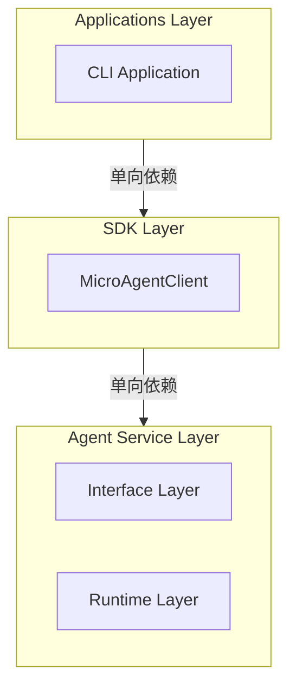

# 🐈 MicroAgent — 超轻量级个人 AI 助手

<div align="center">
  
</div>

<p align="center">
  <a href="https://github.com/jesspig/micro-agent"></a>
  <a href="https://bun.sh/"></a>
  <a href="https://www.typescriptlang.org/"></a>
  <a href="LICENSE"></a>
  <a href="https://github.com/jesspig/micro-agent/stargazers"></a>
</p>

<p align="center">基于 <strong>Bun + TypeScript</strong> 的超轻量级个人 AI 助手框架，三层架构设计。</p>

<p align="center"><a href="https://jesspig.github.io/micro-agent/">📖 在线文档</a> · <a href="https://jesspig.github.io/micro-agent/guide/changelog/">📦 更新日志</a> · <a href="https://github.com/jesspig/micro-agent/discussions">💬 讨论区</a></p>

---

## 特性

- 🪶 **轻量高效** — Bun 原生性能，三层架构（Applications → SDK → Agent Service）
- 🧠 **长期记忆** — LanceDB 向量存储、混合检索、遗忘引擎、AI 分类
- 🎯 **意图识别** — 分阶段意图识别管道，支持上下文重试
- 📚 **知识库** — PDF/Word/Excel 文档解析，RAG 检索，引用溯源
- 💬 **多通道** — CLI、飞书，消息聚合与响应广播
- 🔌 **MCP 兼容** — Model Context Protocol 工具接口，热重载支持
- 📊 **结构化日志** — 调用链追踪，LLM/工具/记忆检索可观测

---

## 📢 最新更新

- **2026-03-10** 🏗️ **v0.3.0** — 架构重构
  - 三层架构：Applications → SDK → Agent Service
  - Kernel：Orchestrator（ReAct）、Planner、ExecutionEngine、ContextManager
  - Provider：7 个 LLM 厂商适配（OpenAI/DeepSeek/GLM/Kimi/MiniMax/Ollama/Compatible）
  - 记忆系统：混合检索（向量+全文+RRF）、遗忘引擎、AI 分类
  - SDK：MicroAgentClient 统一入口，IPC/HTTP/WebSocket 传输
  - Interface Layer：4 种 IPC 协议 + HTTP Server + SSE Streaming

- **2026-03-02** 🚀 **v0.2.2** — 意图识别、知识库、引用溯源
- **2026-02-27** 📦 **v0.2.1** — 项目重命名与代码清理
- **2026-02-24** 🏗️ **v0.2.0** — 架构重构 + 多协议支持

---

## 运行环境

> **注意**：本项目专为 [Bun](https://bun.sh/) 运行时设计，**不支持 Node.js**。

| 要求 | 版本 |
|------|------|
| Bun | 1.3.10 |
| TypeScript | 5.9.3 |

---

## 安装

```bash
# 克隆项目
git clone https://github.com/jesspig/micro-agent.git
cd micro-agent

# 安装依赖
bun install

# 启动服务
bun start
```

首次启动自动创建 `~/.micro-agent/settings.yaml` 配置文件。

---

## CLI 命令

```bash
micro-agent <command> [options]

Commands:
  start       启动服务
  status      显示状态
  ext         扩展管理

Options:
  -c, --config <path>   配置文件路径
  -v, --verbose         详细日志模式
  -q, --quiet           静默模式
  -h, --help            显示帮助
  --version             显示版本
```

---

## 架构



| 层级 | 职责 | 可引入第三方库 |
|------|------|---------------|
| Applications | CLI、Web、配置管理、提示词模板 | ✓ |
| SDK | 客户端 API、高级能力封装 | ✓ |
| Agent Service | Interface Layer + Runtime Layer | ✗ |

---

## 核心包

| 包名 | 路径 | 说明 |
|------|------|------|
| `@micro-agent/core` | `/` | 根包，统一入口 |
| `@micro-agent/agent-service` | `agent-service/` | Agent 运行时服务 |
| `@micro-agent/client-sdk` | `sdk/` | 开发者 SDK |

### Agent Service 内部结构

```
agent-service/
├── interface/          # Interface Layer - 通信接口
│   ├── ipc/           # 进程间通信（stdio/named-pipe/unix-socket/tcp-loopback）
│   ├── http/          # HTTP 服务
│   └── streaming/     # 流式响应（SSE）
├── runtime/           # Runtime Layer - 运行时核心
│   ├── kernel/        # 内核（Orchestrator/Planner/ExecutionEngine/ContextManager）
│   ├── capability/    # 能力（Tool/Skill/Memory/Knowledge/MCP/Plugin）
│   ├── provider/      # 提供者（LLM/Embedding/VectorDB/Storage）
│   └── infrastructure/ # 基础设施（Container/EventBus/Database/Config/Logging）
└── types/             # 核心类型定义（MCP 兼容）
```

---

## 内置工具

| 工具 | 说明 |
|------|------|
| `read` | 读取文件内容 |
| `write` | 创建或覆盖文件 |
| `edit` | 精确编辑文件（查找替换） |
| `exec` | 执行 Shell 命令 |
| `glob` | 文件模式匹配查找 |
| `grep` | 内容正则搜索 |
| `list_directory` | 列出目录内容 |
| `todo_write` | 任务列表管理 |
| `todo_read` | 读取任务列表 |
| `ask_user` | 用户交互提问 |

---

## 内置技能

| 技能 | 说明 | 依赖 |
|------|------|------|
| `time` | 时间查询、格式转换、时区处理 | - |
| `sysinfo` | CPU、内存、磁盘、网络、进程状态 | bun>=1.0 |
| `docx` | Word 文档处理 | mammoth |
| `pdf` | PDF 文档处理 | pdf-parse |
| `xlsx` | Excel 处理 | xlsx |
| `pptx` | PowerPoint 处理 | pptxgenjs |
| `doc-coauthoring` | 文档协作 | - |
| `skill-creator` | 创建或更新技能 | - |

---

## LLM Provider

**模型格式**: `provider/model`（如 `ollama/qwen3`、`deepseek/deepseek-chat`）

### 支持的厂商

| 厂商 | 思考模型 | 特殊处理 |
|------|----------|----------|
| OpenAI | o1, o3 系列 | `reasoning_effort` 参数 |
| DeepSeek | deepseek-reasoner, r1 | `thinking` 参数 |
| GLM (智谱) | glm-4-plus | `enable_cot` 参数 |
| Kimi (Moonshot) | kimi-thinking | `reasoning.effort` 参数 |
| MiniMax | m2.x 系列 | `thinking` + `groupId` |
| Ollama | deepseek-r1, qwen3 | 自动解析 `<think/>` 标签 |
| OpenAI Compatible | 视模型 | 通用适配 |

### Ollama（本地运行）

```yaml
providers:
  ollama:
    baseUrl: http://localhost:11434/v1
    models: [qwen3, qwen3-vl]

agents:
  models:
    chat: ollama/qwen3
    vision: ollama/qwen3-vl
```

### DeepSeek

```yaml
providers:
  deepseek:
    baseUrl: https://api.deepseek.com/v1
    apiKey: ${DEEPSEEK_API_KEY}
    models: [deepseek-chat, deepseek-reasoner]

agents:
  models:
    chat: deepseek/deepseek-chat
    coder: deepseek/deepseek-chat
```

---

## 通道配置

### 飞书

使用 WebSocket 长连接，无需公网 IP。

1. 创建飞书应用 → 启用机器人能力
2. 权限：添加 `im:message` 和 `im:resource`
3. 事件订阅：选择「使用长连接接收事件」，添加 `im.message.receive_v1`
4. 获取 App ID 和 App Secret

```yaml
channels:
  feishu:
    enabled: true
    appId: cli_xxx
    appSecret: xxx
```

---

## 数据目录

```
~/.micro-agent/
├── settings.yaml          # 用户配置
├── data/                  # 数据存储
│   ├── sessions.db        # 会话存储（SQLite）
│   └── knowledge.db       # 知识库索引（SQLite）
├── memory/                # 记忆系统数据
│   ├── lancedb/           # LanceDB 向量存储
│   ├── sessions/          # 会话记忆（Markdown）
│   └── summaries/         # 摘要归档
├── knowledge/             # 知识库文档
├── logs/                  # 日志文件
├── skills/                # 用户技能
└── extensions/            # 用户插件
```

---

## 开发

```bash
bun run dev          # 开发模式
bun run typecheck    # 类型检查
bun test             # 运行测试
```

---

## 项目结构

```
micro-agent/
├── agent-service/           # Agent 运行时服务
│   ├── interface/           # 接口层（IPC/HTTP/Streaming）
│   ├── runtime/             # 运行时核心
│   │   ├── kernel/          # 编排器、规划器、执行引擎
│   │   ├── capability/      # 工具、技能、记忆、知识库
│   │   ├── provider/        # LLM、Embedding、VectorDB
│   │   └── infrastructure/  # 容器、事件总线、数据库
│   ├── types/               # 核心类型定义
│   └── tests/               # 测试
├── sdk/                     # 开发者 SDK
│   └── src/
│       ├── api/             # 客户端 API（Chat/Memory/Session/Config）
│       ├── client/          # 客户端核心
│       ├── transport/       # 传输层（IPC/HTTP/WebSocket）
│       ├── memory/          # 记忆高级封装
│       ├── knowledge/       # 知识库高级封装
│       └── define/          # 扩展定义函数
├── applications/            # 应用层
│   └── cli/                 # CLI 应用
│       └── src/
│           ├── app.ts       # 应用入口
│           ├── modules/     # 功能模块
│           ├── commands/    # CLI 命令
│           ├── builtin/     # 内置扩展
│           │   ├── tool/    # 内置工具
│           │   ├── skills/  # 内置技能
│           │   └── channel/ # 内置通道
│           ├── plugins/     # 插件系统
│           └── templates/   # 提示词模板
├── docs/                    # 在线文档（VitePress）
├── assets/                  # 静态资源
└── package.json             # 根包配置
```

---

## License

MIT
