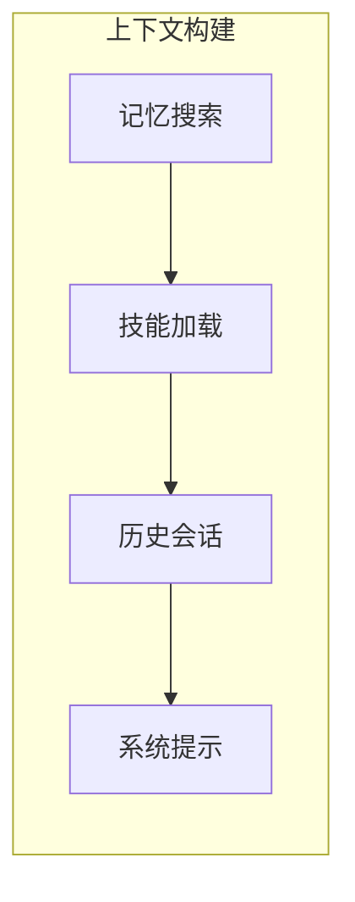
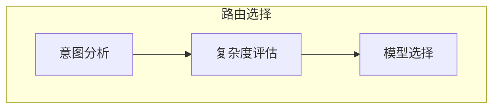
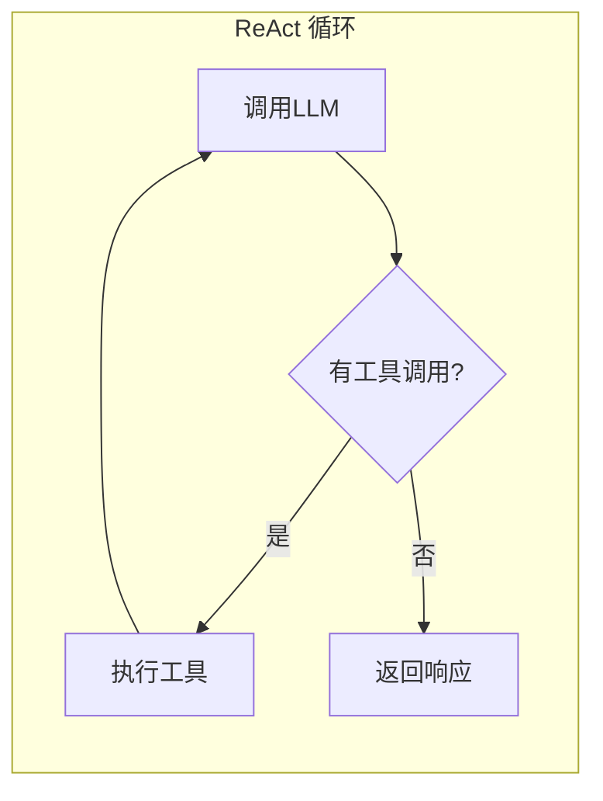

# Agent - 智能代理

## 概述

Agent 实现了 ReAct（Reasoning + Acting）模式，是系统的核心智能组件。

## 工作流程

### 整体流程


### 上下文构建



### 智能路由



### ReAct 循环



## 配置

```typescript
interface AgentConfig {
  workspace: string;
  models?: {
    chat: string;
    check?: string;
  };
  maxIterations: number;
  generation?: GenerationConfig;
  auto?: boolean;
  max?: boolean;
  availableModels?: Map<string, ModelConfig[]>;
  routing?: RoutingConfig;
}
```

## 上下文构建

Agent 使用 ContextBuilder 构建 LLM 上下文：

1. 加载 always=true 的技能
2. 搜索相关记忆
3. 获取会话历史
4. 合并系统提示

## 智能路由

根据任务复杂度自动选择模型：

- **fast**: 简单问候、感谢
- **low**: 翻译、格式化
- **medium**: 常规对话、修改
- **high**: 调试、分析
- **ultra**: 架构设计、重构

## 源码位置

`packages/core/src/agent/`
