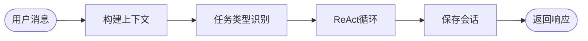
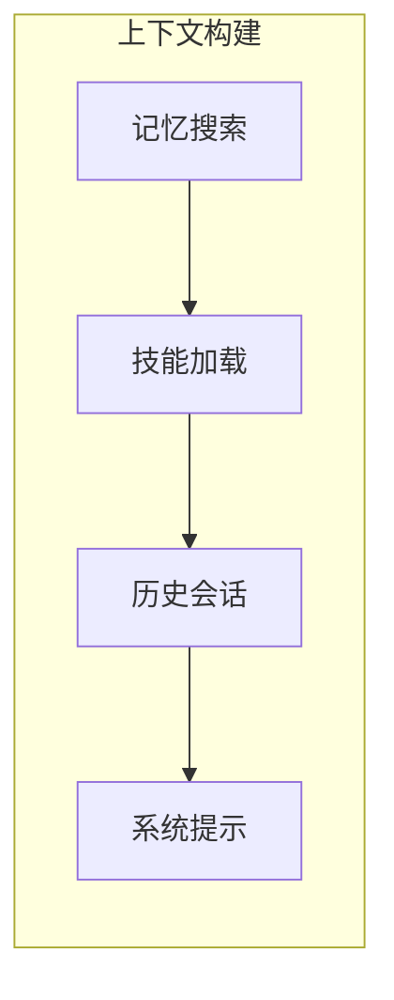
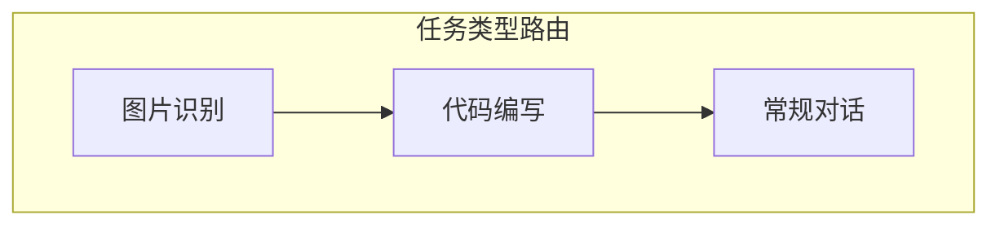
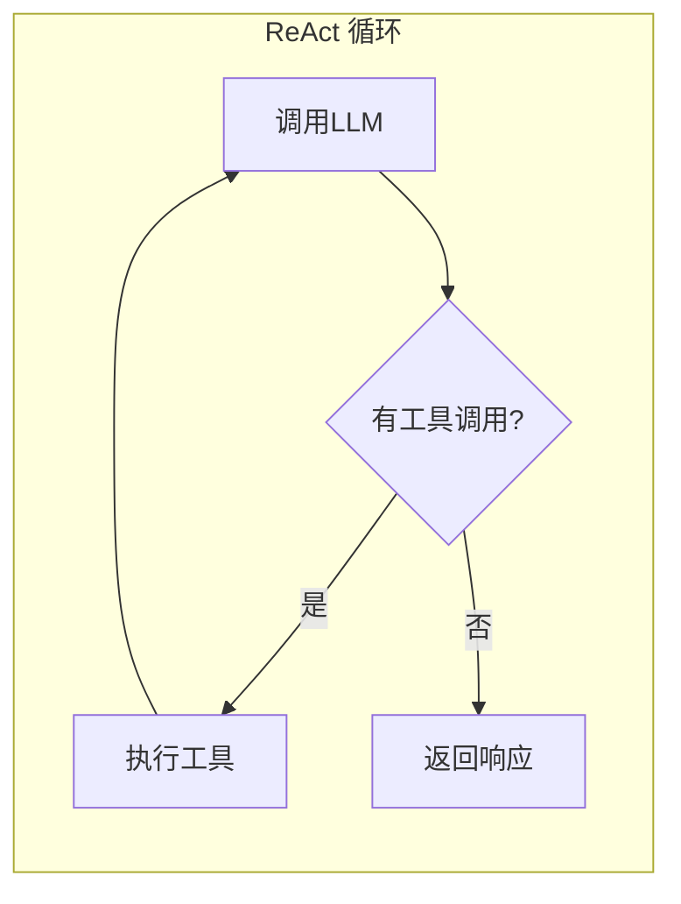

# Agent - 智能代理

## 概述

Agent 实现了双执行模式：
- **Function Calling 模式**：主流 LLM 的原生工具调用方式
- **ReAct 模式**：基于 JSON 结构化输出的推理-行动循环

## 工作流程

### 整体流程



### 上下文构建



### 任务类型识别



### ReAct 循环



## 配置

```typescript
interface AgentConfig {
  workspace: string;
  models?: {
    chat: string;      // 常规对话模型（默认）
    vision?: string;   // 图片识别模型（默认使用 chat）
    coder?: string;    // 编程模型（默认使用 chat）
    intent?: string;   // 意图识别模型（默认使用 chat）
  };
  maxIterations: number;
  generation?: GenerationConfig;
  availableModels?: Map<string, ModelConfig[]>;
}
```

## 上下文构建

Agent 使用 ContextBuilder 构建 LLM 上下文：

1. 加载 always=true 的技能
2. 搜索相关记忆
3. 获取会话历史
4. 合并系统提示

## 任务类型路由

Agent 通过意图识别判断任务类型，选择对应模型：

| 任务类型 | 触发条件 | 使用模型 |
|----------|----------|----------|
| 图片识别 | 用户消息包含图片或请求识别图片 | models.vision（默认 chat）|
| 代码编写 | 用户请求编写、调试、修复代码 | models.coder（默认 chat）|
| 常规对话 | 其他所有情况 | models.chat |

## 源码位置

`packages/runtime/src/executor/`
