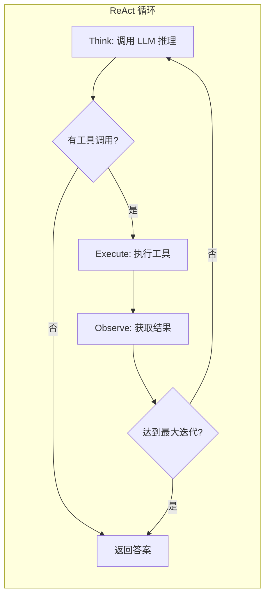
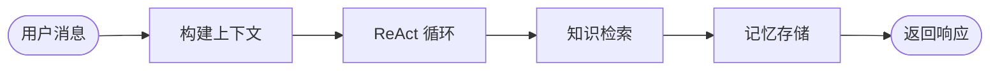
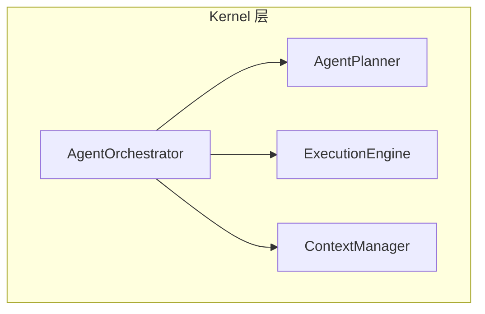
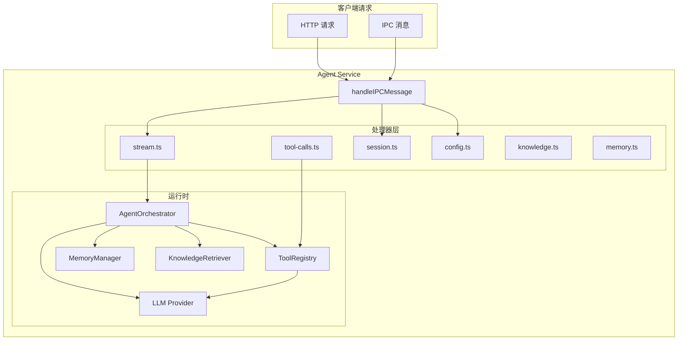

# Agent - 智能代理

## 概述

AgentOrchestrator 是 Agent 核心编排器，采用 **ReAct（Reasoning + Acting）循环**模式实现智能代理行为。

ReAct 循环通过推理-行动-观察的迭代过程，让 Agent 能够自主决定是否需要调用工具，并在必要时持续迭代直到获得满意答案。

## 工作流程

### ReAct 循环流程


```mermaid
flowchart TB
    subgraph ReAct[ReAct 循环]
        direction TB
        Think[Think: 调用 LLM 推理] --> Decision{有工具调用?}
        Decision -->|否| Return[返回答案]
        Decision -->|是| Execute[Execute: 执行工具]
        Execute --> Observe[Observe: 获取结果]
        Observe --> Check{达到最大迭代?}
        Check -->|否| Think
        Check -->|是| Return
    end
```

### 整体流程


```mermaid
flowchart LR
    Start([用户消息]) --> Context[构建上下文]
    Context --> ReAct[ReAct 循环]
    ReAct --> Knowledge[知识检索]
    Knowledge --> Memory[记忆存储]
    Memory --> End([返回响应])
```

### 核心组件


```mermaid
flowchart TB
    subgraph Kernel[Kernel 层]
        Orchestrator[AgentOrchestrator]
        Planner[AgentPlanner]
        ExecutionEngine[ExecutionEngine]
        ContextManager[ContextManager]
    end
    
    Orchestrator --> Planner
    Orchestrator --> ExecutionEngine
    Orchestrator --> ContextManager
```

## 配置

```typescript
interface AgentConfig {
  maxIterations: number;      // 最大迭代次数（默认 10）
  model: string;              // 模型名称（格式: provider/model）
  systemPrompt?: string;      // 系统提示词
  temperature?: number;       // 温度参数
  tools?: Tool[];             // 可用工具
  skills?: Skill[];           // 加载的技能
  memoryEnabled?: boolean;    // 启用记忆系统
  knowledgeEnabled?: boolean; // 启用知识库
}
```

## ReAct 循环实现

```typescript
// AgentOrchestrator 核心逻辑
class AgentOrchestrator {
  async processMessage(msg: InboundMessage): Promise<OutboundMessage> {
    let iterations = 0;
    
    while (iterations < this.maxIterations) {
      // 1. 思考阶段：调用 LLM
      const response = await this.llmProvider.chat(messages, tools);
      
      // 2. 判断是否需要工具调用
      if (!response.hasToolCalls) {
        return response.content;  // 直接返回答案
      }
      
      // 3. 执行阶段：执行工具
      for (const toolCall of response.toolCalls) {
        const result = await this.executionEngine.execute(toolCall);
        messages.push({ role: 'tool', content: result });
      }
      
      iterations++;
    }
  }
}
```

### 困惑检测

AgentOrchestrator 内置困惑检测机制，防止陷入无限循环：

| 配置项 | 默认值 | 说明 |
|--------|--------|------|
| `maxIterations` | 10 | 最大迭代次数 |
| 连续失败阈值 | 3 | 连续工具调用失败次数达到此值时停止 |

### 知识检索

集成 KnowledgeRetriever 支持 RAG 检索：

```typescript
const knowledgeResults = await this.knowledgeRetriever.retrieve(query);
```

### 记忆管理

集成 SimpleMemoryManager 存储对话记忆：

```typescript
// 存储重要信息
await this.memoryManager.store(sessionId, {
  content: '用户偏好',
  type: 'preference',
});

// 检索相关记忆
const memories = await this.memoryManager.search(query);
```

## 上下文管理

ContextManager 负责管理 Token 预算和上下文构建：

1. 计算可用 Token 空间
2. 压缩/截断历史消息
3. 优先保留关键上下文

## 流式响应

支持流式输出，通过 `processMessageStream` 方法：

```typescript
await orchestrator.processMessageStream(
  message,
  (chunk) => process.stdout.write(chunk),
  toolContext,
  (state) => console.log(state)
);
```

## 源码位置

`agent-service/runtime/kernel/orchestrator/`

## Handlers - 消息处理器

Handlers 是 Agent Service 的消息处理层，负责接收外部请求并分发给相应的组件处理。

### 处理器目录结构

```
agent-service/src/handlers/
├── index.ts      # 统一导出入口
├── ipc.ts        # IPC 消息分发
├── stream.ts     # 流式聊天处理
├── tool-calls.ts # 工具调用执行
├── session.ts    # 会话管理
├── knowledge.ts  # 知识库配置
├── memory.ts     # 记忆系统配置
├── config.ts     # 配置更新/工具/技能加载
└── standalone.ts # 独立模式启动
```

### 消息处理流程


```mermaid
flowchart TB
    subgraph Client[客户端请求]
        HTTP[HTTP 请求]
        IPC[IPC 消息]
    end
    
    subgraph AgentService[Agent Service]
        Handler[handleIPCMessage]
        
        subgraph Handlers[处理器层]
            Stream[stream.ts]
            ToolCalls[tool-calls.ts]
            Session[session.ts]
            Config[config.ts]
            Knowledge[knowledge.ts]
            Memory[memory.ts]
        end
        
        subgraph Runtime[运行时]
            Orch[AgentOrchestrator]
            LLM[LLM Provider]
            ToolReg[ToolRegistry]
            MemMgr[MemoryManager]
            KnowRet[KnowledgeRetriever]
        end
    end
    
    HTTP --> Handler
    IPC --> Handler
    Handler --> Stream
    Handler --> Session
    Handler --> Config
    
    Stream --> Orch
    Orch --> LLM
    Orch --> ToolReg
    Orch --> MemMgr
    Orch --> KnowRet
    
    ToolCalls --> ToolReg
    ToolReg --> LLM
```

### IPC 方法映射

| 方法 | 处理器文件 | 描述 |
|------|-----------|------|
| `ping` | ipc.ts | 心跳检测 |
| `status` | session.ts | 服务状态查询 |
| `execute` | session.ts | 单次执行（非流式）|
| `chat` | stream.ts | 流式聊天 |
| `config.update` | config.ts | 更新配置 |
| `config.setSystemPrompt` | config.ts | 设置系统提示词 |
| `config.registerTools` | config.ts | 注册工具 |
| `config.loadSkills` | config.ts | 加载技能 |
| `config.configureMemory` | memory.ts | 配置记忆系统 |
| `config.configureKnowledge` | knowledge.ts | 配置知识库 |
| `config.reload` | index.ts | 重载配置 |

### 流式处理策略

Handler 层支持多种流式处理策略，按优先级 fallback：

1. **Orchestrator 模式**: 使用 AgentOrchestrator 进行完整 ReAct 循环
2. **直接 LLM 模式**: 直接调用 LLM Provider 流式响应
3. **模拟响应模式**: 无 LLM 时返回模拟响应（调试用）

```typescript
// 策略选择逻辑
if (components.orchestrator) {
  await streamWithOrchestrator(sessionId, content.text, requestId, components, config);
  return;
}
if (components.llmProvider) {
  await streamFromLLM(session, content.text, requestId, components, config);
  return;
}
await streamMockResponse(content.text, requestId);
```

### 工具调用处理

Tool-calls Handler 负责执行 LLM 产生的工具调用：

1. 遍历工具调用列表
2. 构建 ToolContext（channel/chatId/workspace/currentDir/knowledgeBase）
3. 通过 ToolRegistry 执行工具
4. 将工具结果添加到消息历史
5. 重新调用 LLM 获取最终响应

```typescript
// 工具调用流程
for (const tc of toolCalls) {
  const toolContext: ToolContext = {
    channel: 'ipc',
    chatId: requestId,
    workspace: workspace ?? process.cwd(),
    currentDir: workspace ?? process.cwd(),
    knowledgeBase: knowledgeBase ?? USER_KNOWLEDGE_DIR,
  };
  
  const result = await components.toolRegistry.execute(tc.name, tc.arguments, toolContext);
  messages.push({ role: 'user', content: `工具 ${tc.name} 结果: ${resultContent}` });
}

const finalResponse = await components.llmProvider.chat(messages, undefined, components.defaultModel);
```

### 会话管理

SessionHandler 维护会话状态：

```typescript
class SessionManager {
  private _sessions = new Map<string, SessionData>();
  
  getOrCreate(sessionId: string): SessionData  // 懒创建
  get(sessionId: string): SessionData | undefined
  addMessage(sessionId: string, role: string, content: string): void
  get size(): number
  clear(): void
}
```

### 源码位置

- Handlers: `agent-service/src/handlers/`
- Orchestrator: `agent-service/runtime/kernel/orchestrator/`
