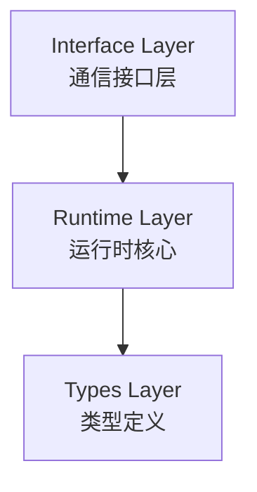
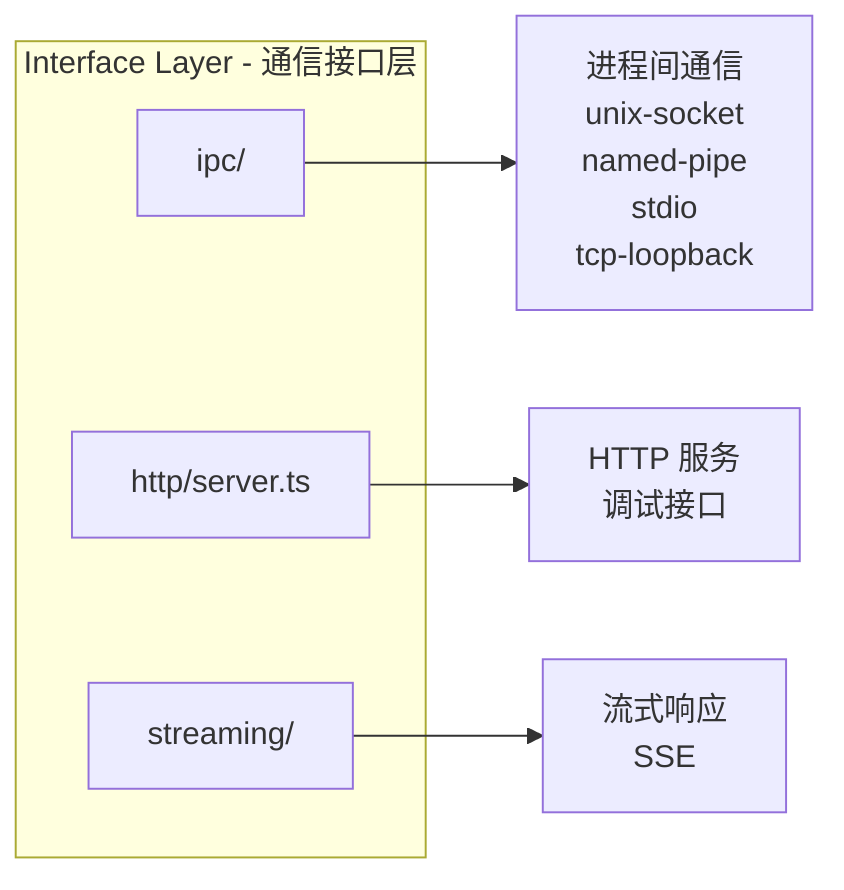
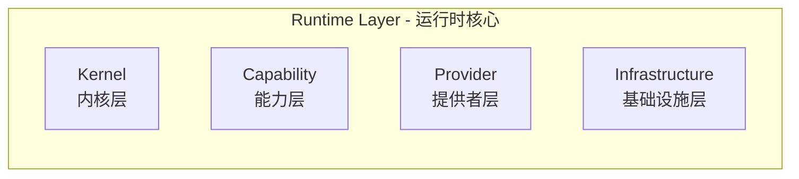
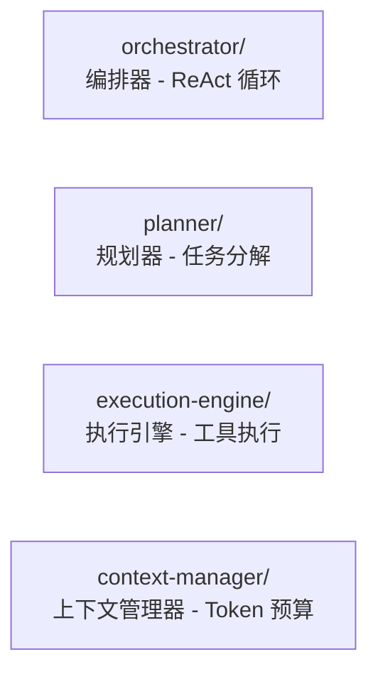
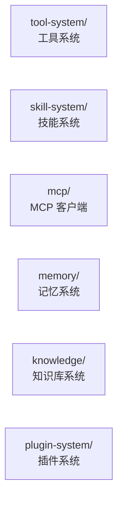
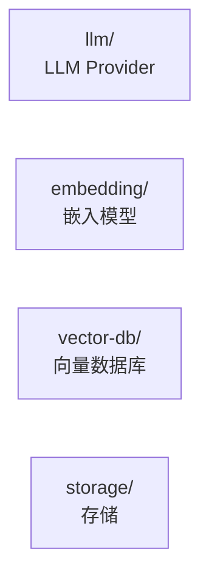
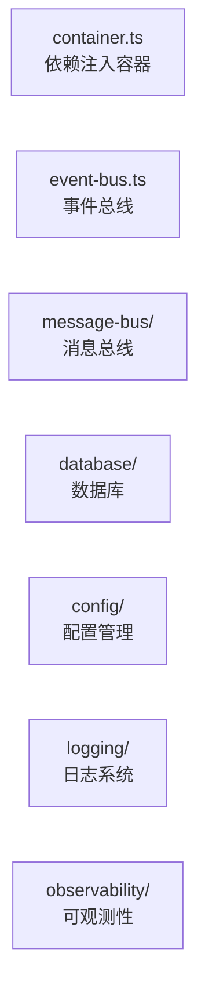

# 核心模块

MicroAgent 采用分层架构，核心功能分布在多个模块中。

## 架构概览

### 整体架构



### Interface Layer



### Runtime Layer



#### Kernel 内核层



#### Capability 能力层



#### Provider 提供者层



#### Infrastructure 基础设施层



## 核心模块详解

### Kernel 层

#### Orchestrator（编排器）

ReAct 循环的核心实现，负责协调整个 Agent 的思考和执行过程。

```
ReAct 循环:
1. 思考 (Thinking) → 获取历史 + 记忆 + 知识库上下文
2. 执行 (Acting) → 调用 LLM，执行工具
3. 观察 (Observing) → 观察结果，更新上下文
4. 循环直到完成或达到最大迭代
```

关键特性：
- 最大迭代保护（默认 20 次）
- 困惑检测（连续 3 次工具调用失败）
- 中止机制支持

#### Planner（规划器）

将复杂任务分解为可执行的子任务。

```typescript
interface PlanResult {
  mainTask: string;
  subTasks: SubTask[];
  executionOrder: string[][];  // 拓扑排序后的执行层级
}
```

#### ContextManager（上下文管理器）

管理对话上下文和 Token 预算。

```typescript
interface TokenBudgetConfig {
  total: number;    // 总 Token 数
  system: number;   // 系统提示预留
  tools: number;    // 工具定义预留
  context: number;  // 对话上下文
  rag: number;      // RAG 检索内容
}
```

### Capability 层

#### Tool System（工具系统）

管理 Agent 可调用的工具。

```typescript
class ToolRegistry {
  register(tool: Tool): void;
  get(name: string): Tool | undefined;
  execute(name: string, input: unknown, ctx: ToolContext): Promise<string>;
  getDefinitions(): ToolDefinition[];
}
```

#### Memory System（记忆系统）

提供记忆的存储、检索和管理。

检索模式：
- `vector`: 向量语义检索
- `fulltext`: 全文关键词检索
- `hybrid`: RRF 融合检索
- `auto`: 自动选择（向量优先）

记忆类型：
- `preference`: 偏好
- `fact`: 事实
- `decision`: 决策
- `entity`: 实体
- `conversation`: 对话
- `summary`: 摘要
- `document`: 文档
- `other`: 其他

#### Knowledge System（知识库系统）

管理文档索引和语义检索。

支持格式：Markdown, Text, PDF, Word, Excel, CSV, JSON, YAML, HTML

处理流程：扫描 → 分块 → 向量化 → 索引 → 检索

### Provider 层

#### LLM Provider

统一的多模型适配层，支持：
- OpenAI (GPT, o1, o3)
- DeepSeek
- GLM (智谱)
- Kimi (Moonshot)
- MiniMax
- Ollama (本地)
- OpenAI 兼容模型

#### Embedding Provider

向量嵌入服务：
- `OpenAIEmbeddingProvider`: OpenAI Embedding API
- `LocalEmbeddingProvider`: Ollama 本地嵌入

#### Vector DB Provider

向量数据库：
- `LanceDBProvider`: LanceDB 持久化存储
- `LocalVectorProvider`: 内存向量存储

### Infrastructure 层

#### Container（依赖注入容器）

```typescript
class ContainerImpl {
  register<T>(token: string, factory: Factory<T>): void;
  singleton<T>(token: string, factory: Factory<T>): void;
  resolve<T>(token: string): T;
  has(token: string): boolean;
}
```

#### EventBus（事件总线）

```typescript
class EventBus {
  on(event: EventType, handler: EventHandler): void;
  off(event: EventType, handler: EventHandler): void;
  emit(event: EventType, payload: unknown): Promise<void>;
  once(event: EventType, handler: EventHandler): void;
}
```

#### Database（数据库）

- `SessionStore`: SQLite 会话存储
- `KVMemoryStore`: 键值内存存储（支持 TTL）

## 核心类型

| 类型 | 位置 | 说明 |
|------|------|------|
| SessionKey | `types/session.ts` | 会话标识（格式：channel:chatId） |
| LLMMessage | `types/message.ts` | LLM 消息格式 |
| Tool | `types/tool.ts` | 工具定义 |
| ToolResult | `types/tool.ts` | 工具执行结果 |
| MemoryEntry | `types/memory.ts` | 记忆条目 |
| ProviderCapabilities | `types/provider.ts` | Provider 能力定义 |

## 快速开始

### SDK 客户端

```typescript
import { createClient } from '@micro-agent/sdk';

const client = createClient({
  transport: 'ipc',
});

// 流式聊天
for await (const chunk of client.chatStream({
  sessionId: 'default',
  content: '你好！',
})) {
  console.log(chunk);
}
```

### 运行时组件

```typescript
import {
  ContainerImpl,
  EventBus,
  ToolRegistry,
} from '@micro-agent/sdk/runtime';

// 创建容器
const container = new ContainerImpl();

// 注册组件
container.singleton('eventBus', () => new EventBus());
container.singleton('toolRegistry', () => new ToolRegistry());

// 解析依赖
const tools = container.resolve<ToolRegistry>('toolRegistry');
```
