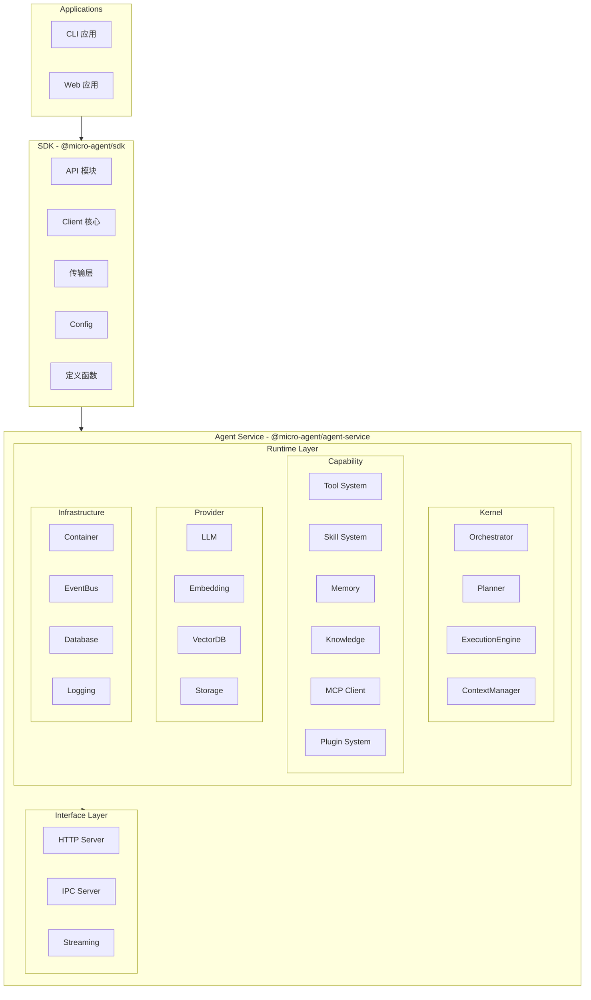
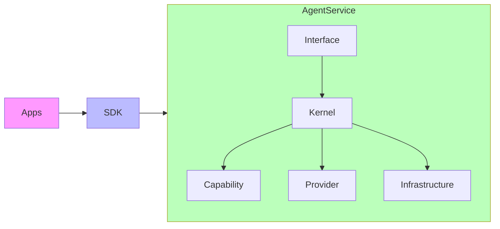

# 核心模块

MicroAgent 采用分层架构，核心功能分布在多个模块中。

## 架构概览



## 完整目录结构

```
├── agent-service/              # Agent 运行时服务
│   ├── types/                  # 核心类型定义（MCP 兼容）
│   ├── runtime/                # 运行时引擎
│   │   ├── kernel/            # 核心调度层
│   │   │   ├── orchestrator/  # Agent 编排器（ReAct 循环）
│   │   │   ├── planner/       # 任务规划器
│   │   │   ├── execution-engine/ # 工具执行引擎
│   │   │   └── context-manager/  # 上下文管理
│   │   ├── capability/       # 能力层
│   │   │   ├── tool-system/  # 工具注册表
│   │   │   ├── skill-system/ # 技能系统
│   │   │   ├── memory/       # 记忆系统
│   │   │   ├── knowledge/    # 知识库系统
│   │   │   ├── mcp/          # MCP 客户端
│   │   │   └── plugin-system/ # 插件系统
│   │   ├── provider/         # 模型提供商
│   │   │   ├── llm/          # LLM 调用
│   │   │   ├── embedding/    # 向量嵌入
│   │   │   ├── vector-db/    # 向量数据库
│   │   │   └── storage/      # 键值存储
│   │   ├── infrastructure/   # 基础设施
│   │   │   ├── container.ts  # 依赖注入容器
│   │   │   ├── event-bus.ts  # 事件总线
│   │   │   ├── database/     # 数据库（SQLite）
│   │   │   ├── config/       # 配置管理
│   │   │   └── logging/      # 日志系统
│   │   └── hook-system/     # 钩子系统
│   ├── interface/            # 通信接口层
│   │   ├── http/             # HTTP 服务器
│   │   ├── ipc/              # IPC 通信（TCP/Unix/stdio）
│   │   └── streaming/        # 流式响应（SSE）
│   ├── src/                  # 服务实现
│   │   ├── handlers/         # 消息处理器
│   │   └── initialization.ts # 初始化流程
│   └── tests/                # 测试文件
│
├── sdk/                       # 开发者 SDK
│   └── src/
│       ├── api/              # 客户端 API
│       ├── client/           # 客户端核心
│       ├── transport/        # 传输层（HTTP/WS/IPC）
│       ├── config/           # 配置高级封装
│       ├── define/           # 定义函数
│       ├── memory/           # 记忆高级封装
│       ├── knowledge/        # 知识库高级封装
│       ├── llm/              # LLM 路由
│       └── tool/             # 工具构建器
│
└── applications/cli/          # CLI 应用
    └── src/
        ├── builtin/          # 内置扩展
        │   ├── tool/         # 核心工具
        │   ├── channel/     # 通道（飞书）
        │   └── skills/       # 技能
        ├── commands/         # CLI 命令
        ├── modules/          # 核心模块
        └── plugins/          # 插件系统
```

## 核心模块

| 模块 | 路径 | 说明 |
|------|------|------|
| [Types](/core/) | `agent-service/types/` | 核心类型定义（MCP 兼容） |
| [Runtime](/core/) | `agent-service/runtime/` | 运行时引擎 |
| [SDK](/api/) | `sdk/` | 开发者 SDK |
| [Container](container) | `agent-service/runtime/infrastructure/` | 依赖注入容器 |
| [Provider](provider) | `agent-service/runtime/provider/` | LLM 提供商接口 |
| [Agent](agent) | `agent-service/runtime/kernel/` | Agent 编排器 |
| [Memory](memory) | `agent-service/runtime/capability/memory/` | 记忆系统 |
| [Tool](tool) | `agent-service/runtime/capability/tool-system/` | 工具系统 |
| [Skill](skill) | `agent-service/runtime/capability/skill-system/` | 技能系统 |
| [Knowledge](/core/) | `agent-service/runtime/capability/knowledge/` | 知识库系统 |
| [Storage](storage) | `agent-service/runtime/infrastructure/database/` | 存储层 |
| [Channel](channel) | `extensions/channel/` | 消息通道 |

## 模块间依赖关系



## 依赖规则

- **单向依赖**: Applications → SDK → Agent Service
- **项目隔离**: Agent Service 与 Applications 为独立项目
- **访问限制**: Applications 禁止直接访问 Agent Service，必须通过 SDK 间接调用
- **扩展自由**: Applications 可自由组合 SDK 能力并引入第三方库

## 快速开始

### SDK 客户端

```typescript
import { createClient } from '@micro-agent/sdk';

const client = createClient({
  transport: 'ipc',
});

const response = await client.chat.send({
  sessionId: 'default',
  content: '你好！',
});
```

### 工具定义

```typescript
import { defineTool } from '@micro-agent/sdk';

const myTool = defineTool({
  name: 'my_tool',
  description: '我的自定义工具',
  inputSchema: {
    type: 'object',
    properties: {
      input: { type: 'string' },
    },
  },
  execute: async (input, context) => {
    return { result: `处理: ${input.input}` };
  },
});
```

### 运行时组件

```typescript
import {
  ContainerImpl,
  EventBus,
  ToolRegistry,
  MemoryManager,
} from '@micro-agent/runtime';

// 创建容器
const container = new ContainerImpl();

// 注册组件
container.singleton('toolRegistry', () => new ToolRegistry());

// 解析依赖
const tools = container.resolve<ToolRegistry>('toolRegistry');
```