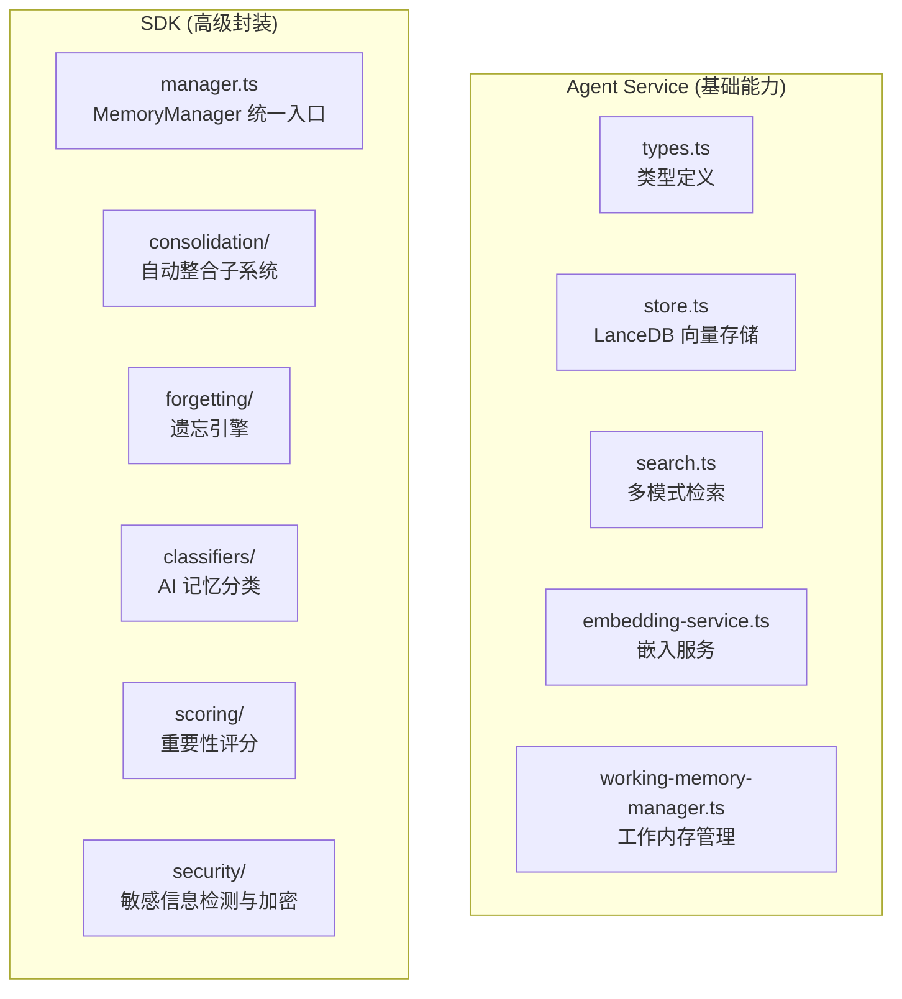
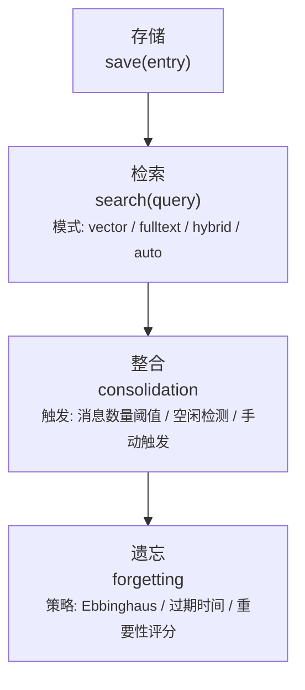

# 记忆系统

MicroAgent 的记忆系统提供智能的记忆存储、检索和管理能力。

## 架构



## 记忆类型

| 类型 | 说明 | 示例 |
|------|------|------|
| preference | 偏好 | "用户喜欢使用 TypeScript" |
| fact | 事实 | "用户的项目使用 Bun 运行时" |
| decision | 决策 | "选择了 SQLite 作为数据库" |
| entity | 实体 | "用户的名字是 Alice" |
| conversation | 对话 | 完整的对话记录 |
| summary | 摘要 | 对话的总结 |
| document | 文档 | 文档内容引用 |
| other | 其他 | 其他类型 |

## 记忆生命周期



## 检索模式

### 向量检索 (vector)

基于语义相似度的检索，使用 LanceDB 存储向量。

```typescript
const results = await memory.vectorSearch('用户偏好', 10);
```

### 全文检索 (fulltext)

基于关键词匹配的检索，使用 SQLite FTS5。

```typescript
const results = await memory.fulltextSearch('TypeScript 配置', 10);
```

### 混合检索 (hybrid)

结合向量和全文检索，使用 RRF（Reciprocal Rank Fusion）融合结果。

```typescript
const results = await memory.hybridSearch('项目配置', {
  vectorLimit: 10,
  fulltextLimit: 10,
  rrfK: 60,
});
```

### 自动选择 (auto)

默认模式，优先使用向量检索，失败时回退到全文检索。

```typescript
const results = await memory.search('用户信息');
```

## 记忆条目结构

```typescript
interface MemoryEntry {
  id: string;                  // 记忆 ID
  type: MemoryType;            // 记忆类型
  content: string;             // 记忆内容
  embedding?: number[];        // 嵌入向量
  createdAt: Date;             // 创建时间
  accessedAt: Date;            // 最后访问时间
  accessCount: number;         // 访问次数
  importance: number;          // 重要性分数 (0-1)
  stability: number;           // 记忆稳定性 (0-1)
  status: MemoryStatus;        // active | archived | protected | deleted
  sessionKey?: string;         // 关联会话
  metadata?: MemoryMetadata;   // 元数据
}
```

## SDK 高级功能

### MemoryManager

```typescript
import { MemoryManager } from '@micro-agent/sdk/memory';

const manager = new MemoryManager({
  store: memoryStore,
  searcher: memorySearcher,
  embeddingService: embeddingService,
});

// 存储
const id = await manager.save({
  type: 'preference',
  content: '用户喜欢使用深色主题',
});

// 检索
const results = await manager.search('用户偏好', { limit: 5 });

// 分类
const classification = await manager.classify('我喜欢用 VS Code');
// { type: 'preference', confidence: 0.85 }
```

### 整合触发器

```typescript
import { ConsolidationTrigger } from '@micro-agent/sdk/memory';

const trigger = new ConsolidationTrigger({
  threshold: 20,           // 消息数量阈值
  idleTimeout: 300000,     // 空闲超时（5分钟）
  autoTrigger: true,       // 自动触发
});

trigger.onTrigger(async () => {
  // 执行整合逻辑
});
```

### 遗忘引擎

```typescript
import { ForgettingEngine } from '@micro-agent/sdk/memory';

const engine = new ForgettingEngine({
  retentionThreshold: 0.1,  // 保持率阈值
  maxAge: 365,              // 最大存活天数
  protectedDays: 7,         // 保护期
});

// 计算保持率（基于 Ebbinghaus 遗忘曲线）
const retention = engine.calculateRetention(entry);

// 获取清理候选
const candidates = await engine.getCandidates();

// 执行清理
const result = await engine.execute({ dryRun: false });
```

### 敏感信息检测

```typescript
import { SensitiveDetector } from '@micro-agent/sdk/memory';

const detector = new SensitiveDetector();

const result = detector.detect('我的 API Key 是 sk-xxx');
// {
//   detected: true,
//   findings: [{ type: 'api_key', value: 'sk-xxx', confidence: 0.95 }],
//   recommendation: 'encrypt'
// }
```

## 工作内存

工作内存管理当前的活跃目标、子任务和上下文。

```typescript
import { WorkingMemoryManager } from '@micro-agent/runtime';

const workingMemory = new WorkingMemoryManager({
  maxActiveGoals: 5,
  maxSubTasks: 20,
});

// 添加目标
workingMemory.addGoal({ description: '完成文档编写' });

// 添加子任务
workingMemory.addSubTask({ description: '编写 API 文档' });

// 获取状态
const state = workingMemory.getState();
```

## 存储位置

| 数据 | 位置 |
|------|------|
| 向量存储 | `~/.micro-agent/data/memory.db` (LanceDB) |
| 全文索引 | `~/.micro-agent/data/memory.db` (SQLite FTS5) |
| Markdown 备份 | `~/.micro-agent/memory/` |

## 配置

```yaml
agents:
  memory:
    enabled: true
    storagePath: ~/.micro-agent/data/memory.db
    autoSummarize: true
    summarizeThreshold: 20
    shortTermRetentionDays: 7
    longTermRetentionDays: 90
    retrievalMode: auto
    maxResults: 10
    minScore: 0.6
```