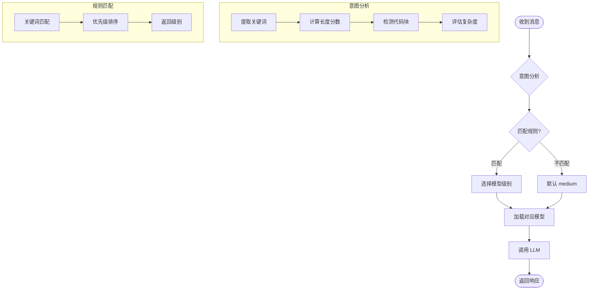

# Provider - LLM 提供商

## 概述

Provider 抽象了 LLM 调用接口，支持 OpenAI 兼容的各种后端。

## 智能路由流程



### 模型级别选择

| 级别 | 关键词 | 适用场景 |
|------|--------|----------|
| fast | 你好、谢谢、再见 | 简单问候 |
| low | 翻译、格式化 | 简单任务 |
| medium | 解释、修改、比较 | 常规对话 |
| high | 实现、调试、分析 | 复杂任务 |
| ultra | 架构、重构、优化 | 专家级任务 |

## 接口定义

```typescript
interface LLMProvider {
  readonly name: string;
  
  chat(
    messages: LLMMessage[],
    tools?: LLMToolDefinition[],
    model?: string,
    config?: GenerationConfig
  ): Promise<LLMResponse>;
  
  getDefaultModel(): string;
  isAvailable(): Promise<boolean>;
  getModelCapabilities(modelId: string): ModelConfig;
  listModels(): Promise<string[] | null>;
}
```

## 类型定义

### LLMMessage

```typescript
type MessageRole = 'system' | 'user' | 'assistant' | 'tool';

interface LLMMessage {
  role: MessageRole;
  content: MessageContent;
  toolCallId?: string;
  toolCalls?: ToolCall[];
}
```

### GenerationConfig

```typescript
interface GenerationConfig {
  maxTokens?: number;
  temperature?: number;
  topK?: number;
  topP?: number;
  frequencyPenalty?: number;
}
```

### LLMResponse

```typescript
interface LLMResponse {
  content: string;
  toolCalls?: ToolCall[];
  hasToolCalls: boolean;
  usedProvider?: string;
  usedModel?: string;
  usedLevel?: string;
}
```

## 内置 Provider

### OpenAICompatibleProvider

支持 OpenAI API 兼容的所有后端：

- OpenAI
- Claude (via API)
- DeepSeek
- Ollama
- LM Studio

```typescript
import { OpenAICompatibleProvider } from '@microbot/sdk/providers';

const provider = new OpenAICompatibleProvider({
  baseUrl: 'https://api.deepseek.com/v1',
  apiKey: process.env.DEEPSEEK_API_KEY,
  model: 'deepseek-chat',
});
```

## 源码位置

- 接口定义: `packages/providers/src/base.ts`
- OpenAI 兼容: `packages/providers/src/openai-compatible.ts`
- 模型网关: `packages/providers/src/gateway.ts`
- 智能路由: `packages/providers/src/router.ts`
