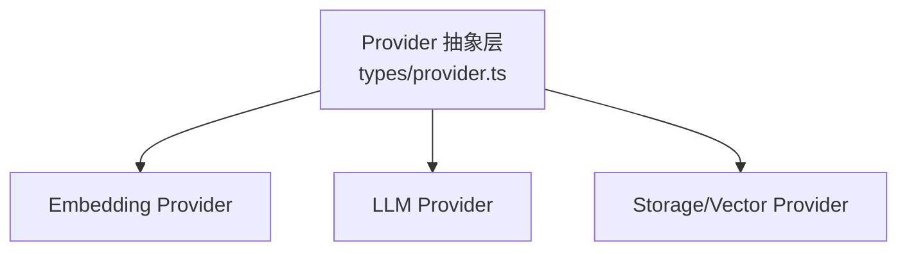
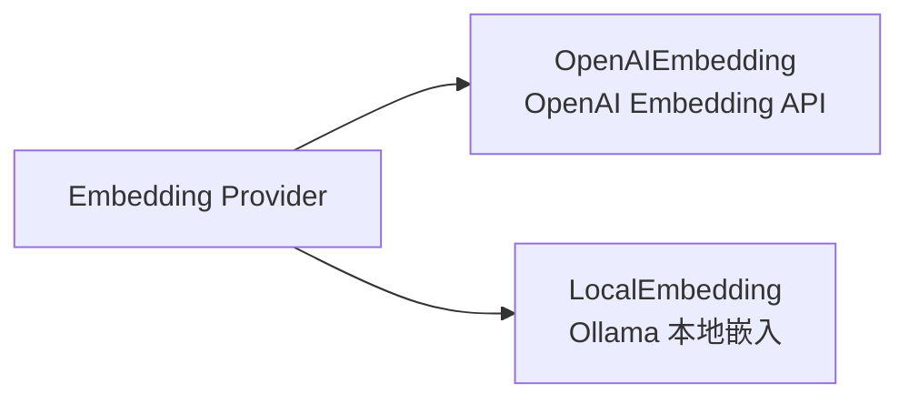
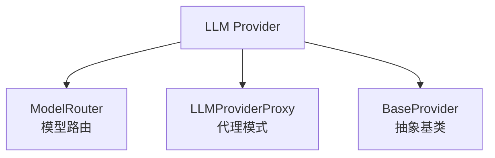
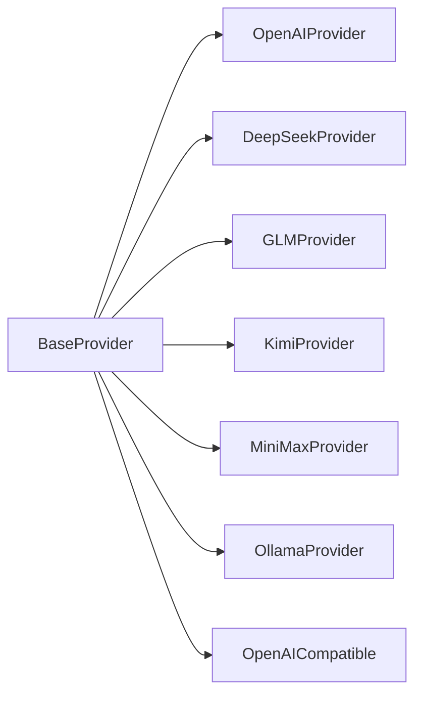
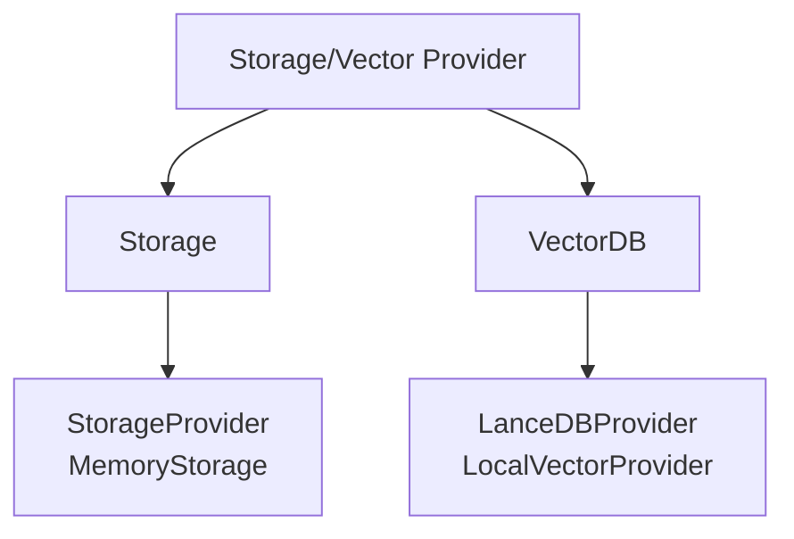

# Provider

MicroAgent 的 Provider 层提供统一的 LLM、嵌入模型和向量数据库访问接口。

## 架构

### 整体架构


```mermaid
flowchart TB
    ABSTRACT["Provider 抽象层<br/>types/provider.ts"]
    
    ABSTRACT --> EMB["Embedding Provider"]
    ABSTRACT --> LLM["LLM Provider"]
    ABSTRACT --> STORAGE["Storage/Vector Provider"]
```

### Embedding Provider


```mermaid
flowchart LR
    EMB["Embedding Provider"]
    
    EMB --> OPENAI_EMB["OpenAIEmbedding<br/>OpenAI Embedding API"]
    EMB --> LOCAL_EMB["LocalEmbedding<br/>Ollama 本地嵌入"]
```

### LLM Provider


```mermaid
flowchart TB
    LLM["LLM Provider"]
    
    LLM --> ROUTER["ModelRouter<br/>模型路由"]
    LLM --> PROXY["LLMProviderProxy<br/>代理模式"]
    LLM --> BASE["BaseProvider<br/>抽象基类"]
```

#### LLM Provider 实现


```mermaid
flowchart LR
    BASE["BaseProvider"]
    
    BASE --> OPENAI["OpenAIProvider"]
    BASE --> DEEP["DeepSeekProvider"]
    BASE --> GLM["GLMProvider"]
    BASE --> KIMI["KimiProvider"]
    BASE --> MINI["MiniMaxProvider"]
    BASE --> OLLAMA["OllamaProvider"]
    BASE --> COMPAT["OpenAICompatible"]
```

### Storage/Vector Provider


```mermaid
flowchart TB
    STORAGE["Storage/Vector Provider"]
    
    STORAGE --> STO_GRP["Storage"]
    STORAGE --> VDB_GRP["VectorDB"]
    
    STO_GRP --> STO_IMPL["StorageProvider<br/>MemoryStorage"]
    VDB_GRP --> VDB_IMPL["LanceDBProvider<br/>LocalVectorProvider"]
```

## LLM Provider

### 接口定义

```typescript
interface LLMProvider {
  readonly type: 'llm';
  
  chat(
    messages: LLMMessage[],
    tools?: LLMToolDefinition[],
    model?: string,
    config?: GenerationConfig
  ): Promise<LLMResponse>;
  
  getDefaultModel(): string | undefined;
  isAvailable(): Promise<boolean>;
  getModelCapabilities(modelId: string): ProviderCapabilities;
  listModels(): Promise<string[] | null>;
}
```

### 能力定义

```typescript
interface ProviderCapabilities {
  vision: boolean;   // 支持视觉能力（图片识别）
  think: boolean;    // 支持思考能力（推理模型）
  tool: boolean;     // 支持工具调用
}
```

## 支持的厂商

| 厂商 | API 端点 | 思考模型 | 特殊处理 |
|------|----------|----------|----------|
| **OpenAI** | api.openai.com/v1 | o1, o3 系列 | o1 系列删除 temperature/top_p |
| **DeepSeek** | api.deepseek.com/v1 | deepseek-reasoner, r1 | 需显式启用 thinking |
| **GLM** | open.bigmodel.cn | glm-4-plus, glm-5 | 支持 CoT 思维链 |
| **Kimi** | api.moonshot.cn/v1 | kimi-k2 | 思考内容为数组格式 |
| **MiniMax** | api.minimax.chat/v1 | m2.x 系列 | 支持 group_id |
| **Ollama** | localhost:11434/v1 | deepseek-r1, qwen3 | 从 `<think/>` 标签提取 |

## 自动厂商检测

```typescript
// 根据 URL 和模型名称自动检测
detectVendor(baseUrl, model) → ProviderVendor

// 检测逻辑
if (url.includes('openai.com')) return 'openai';
if (url.includes('deepseek.com')) return 'deepseek';
if (url.includes('bigmodel.cn')) return 'glm';
if (url.includes('moonshot.cn')) return 'kimi';
if (url.includes('minimax.chat')) return 'minimax';
if (url.includes('localhost:11434')) return 'ollama';
// 默认使用 OpenAI 兼容模式
return 'openai-compatible';
```

## 思考模型支持

### 参数设置

| 厂商 | 参数 |
|------|------|
| OpenAI | `reasoning_effort: 'high'` |
| DeepSeek | `thinking: { type: 'enabled' }` |
| GLM | `enable_cot: true` |
| Kimi | `reasoning: { effort: 'high' }` |
| MiniMax | `thinking: { type: 'enabled' }` |

### 响应解析

```typescript
// 不同厂商的思考内容字段
if (message?.reasoning_content) {
  // DeepSeek 格式
  reasoning = message.reasoning_content;
} else if (message?.reasoning_details) {
  // Kimi 格式（数组）
  reasoning = message.reasoning_details.map(d => d.text).join('');
} else if (message?.reasoning) {
  // GLM 格式
  reasoning = message.reasoning;
}
```

## 模型路由器

### 配置

```typescript
interface ModelRouterConfig {
  chatModel: string;      // 对话模型
  visionModel?: string;   // 视觉模型
  coderModel?: string;    // 编程模型
  intentModel?: string;   // 意图识别模型
  models: Map<string, ModelConfig[]>;
}
```

### 路由策略

| 任务类型 | 选择策略 | 失败降级 |
|----------|----------|----------|
| `vision` | visionModel | **抛出错误** |
| `coder` | coderModel | 降级到 chatModel |
| `chat` | chatModel | 无 |
| `intent` | intentModel | 默认为 chatModel |

### 使用示例

```typescript
import { createModelRouter } from '@micro-agent/sdk/runtime';

const router = createModelRouter({
  chatModel: 'openai/gpt-4o',
  visionModel: 'openai/gpt-4o',
  coderModel: 'deepseek/deepseek-coder',
});

// 根据任务类型选择模型
const result = router.selectByTaskType('coder');
// { model: 'deepseek/deepseek-coder', config: {...}, reason: 'coder task' }
```

## Embedding Provider

### 接口定义

```typescript
interface EmbeddingProvider {
  readonly name: string;
  embed(text: string): Promise<EmbeddingResult>;
  embedBatch(texts: string[]): Promise<EmbeddingResult[]>;
  getDimension(): number;
  isAvailable(): Promise<boolean>;
}
```

### 支持的实现

| Provider | 默认模型 | 维度 |
|----------|----------|------|
| OpenAIEmbeddingProvider | text-embedding-3-small | 1536 |
| LocalEmbeddingProvider (Ollama) | nomic-embed-text | 768 |

### 使用示例

```typescript
import { OpenAIEmbeddingProvider } from '@micro-agent/sdk/runtime';

const embedding = new OpenAIEmbeddingProvider({
  apiKey: process.env.OPENAI_API_KEY,
  model: 'text-embedding-3-small',
});

const result = await embedding.embed('Hello, world!');
console.log(result.vector.length); // 1536
```

## Vector DB Provider

### 接口定义

```typescript
interface VectorDBProvider {
  readonly name: string;
  initialize(): Promise<void>;
  insert(record: VectorRecord): Promise<void>;
  insertBatch(records: VectorRecord[]): Promise<void>;
  search(vector: number[], limit?: number): Promise<SearchResult[]>;
  get(id: string): Promise<VectorRecord | null>;
  delete(id: string): Promise<void>;
  clear(): Promise<void>;
  count(): Promise<number>;
  close(): Promise<void>;
}
```

### 支持的实现

| Provider | 存储 | 适用场景 |
|----------|------|----------|
| LanceDBProvider | 持久化文件 | 生产环境 |
| LocalVectorProvider | 内存 | 开发测试 |

## 配置

```yaml
providers:
  openai:
    baseUrl: https://api.openai.com/v1
    apiKey: ${OPENAI_API_KEY}
    models:
      - gpt-4o
      - gpt-4o-mini
  
  deepseek:
    baseUrl: https://api.deepseek.com/v1
    apiKey: ${DEEPSEEK_API_KEY}
    models:
      - deepseek-chat
      - deepseek-coder
  
  ollama:
    baseUrl: http://localhost:11434/v1
    models:
      - llama3
      - qwen2

agents:
  models:
    chat: openai/gpt-4o
    tool: openai/gpt-4o
    embed: openai/text-embedding-3-small
    vision: openai/gpt-4o
    coder: deepseek/deepseek-coder
```
