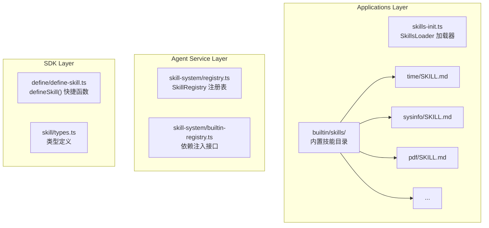

# 技能系统

MicroAgent 的技能系统通过 Markdown 文件定义领域知识和提示词模板。

## 架构



## 技能定义方式

### SKILL.md 格式

```markdown
---
name: time
description: 时间处理工具 - 获取时间、时区转换、时间差计算
dependencies:
  - bun>=1.0
compatibility: bun
always: true
allowed-tools: []
---

# 时间处理工具

这个技能提供了时间相关的处理能力...

## 功能列表

1. 获取当前时间
2. 时区转换
3. 时间差计算
...
```

### defineSkill() 快捷函数

```typescript
import { defineSkill } from '@micro-agent/sdk';

export const mySkill = defineSkill({
  name: 'my-skill',
  description: '我的自定义技能',
  dependencies: ['some-package'],
  license: 'MIT',
  always: false,
  metadata: { emoji: '🔧' },
  allowedTools: ['read_file', 'write_file'],
  content: `
# My Skill

这个技能可以做什么...
  `,
});
```

## 元数据字段

| 字段 | 类型 | 必填 | 说明 |
|------|------|------|------|
| name | string | 是 | 技能名称（kebab-case） |
| description | string | 是 | 技能描述 |
| dependencies | string[] | 否 | 依赖包 |
| license | string | 否 | 许可证 |
| compatibility | string | 否 | 兼容性（bun/node） |
| always | boolean | 否 | 是否自动注入上下文（默认 false） |
| allowed-tools | string[] | 否 | 允许使用的工具列表 |
| metadata | object | 否 | 扩展元数据 |

## 技能类型定义

```typescript
interface Skill {
  name: string;
  description: string;
  dependencies?: string[];
  license?: string;
  compatibility?: string;
  always?: boolean;
  metadata?: SkillMetadata;
  allowedTools?: string[];
  content: string;
  skillPath: string;
}

interface SkillMetadata {
  emoji?: string;
  requires?: SkillRequires;
  install?: SkillInstallSpec[];
}

interface SkillRequires {
  bins?: string[];  // 需要的二进制命令
  env?: string[];   // 需要的环境变量
}

interface SkillInstallSpec {
  id: string;
  kind: string;     // brew, apt, npm 等
  formula?: string;
  bins?: string[];
  label?: string;
}
```

## 加载优先级

```
1. applications/cli/src/builtin/skills/  (内置技能)
2. ~/.micro-agent/skills/                (用户技能)
3. {workspace}/skills/                   (项目技能)
```

## 加载机制

### SkillsLoader

```typescript
class SkillsLoader {
  // 加载所有技能
  load(): void;
  
  // 构建技能摘要表格
  buildSkillsSummary(): string;
  
  // 构建 always=true 的技能完整内容
  buildAlwaysSkillsContent(): string;
  
  // 获取已注入技能名称
  getAlwaysSkillNames(): string[];
  
  // 获取按需加载技能
  getOnDemandSkills(): SkillConfig[];
}
```

### 加载流程

```
应用启动
    │
    ▼
SkillsLoader.load()
    │
    ├── 扫描 builtin/skills/
    ├── 扫描 ~/.micro-agent/skills/
    └── 扫描 {workspace}/skills/
    │
    ▼
解析 SKILL.md frontmatter
    │
    ├── always=true → 注入系统提示
    └── always=false → 按需加载列表
    │
    ▼
构建技能摘要
```

## 内置技能

| 技能名 | 功能 | always |
|--------|------|--------|
| time | 时间处理工具 | true |
| sysinfo | 系统信息技能 | false |
| pdf | PDF 文档处理 | false |
| docx | Word 文档处理 | false |
| xlsx | Excel 处理 | false |
| pptx | PowerPoint 处理 | false |
| doc-coauthoring | 文档协作技能 | false |
| skill-creator | 技能创建工具 | false |

## 技能注册表

```typescript
class SkillRegistry {
  // 注册技能
  register(skill: SkillDefinition): void;
  
  // 获取技能
  get(name: string): SkillDefinition | undefined;
  
  // 列出所有技能
  getAll(): SkillDefinition[];
  
  // 按场景匹配
  matchByScenario(query: string): SkillMatchResult[];
}
```

## 场景匹配

```typescript
// 基于场景关键词匹配技能
const matches = skillRegistry.matchByScenario('我需要处理 PDF 文档');

// 返回结果
// [{
//   skill: { name: 'pdf', description: '...' },
//   score: 0.85,
//   reason: '匹配关键词: PDF'
// }]
```

## 技能名称规范

```typescript
// 必须符合 kebab-case 格式
const SKILL_NAME_REGEX = /^[a-z0-9]+(-[a-z0-9]+)*$/;

// 有效示例
'time'           // ✓
'web-search'     // ✓
'code-review'    // ✓
'data-analysis'  // ✓

// 无效示例
'MySkill'        // ✗ 包含大写
'my_skill'       // ✗ 使用下划线
'my-skill-'      // ✗ 以连字符结尾
```

## 与工具的协作

通过 `allowed-tools` 字段，技能可以预批准特定工具，减少确认开销。

```yaml
---
name: web-search
allowed-tools:
  - fetch
  - read
  - write
---
```

## 目录结构示例

```
skills/
├── time/
│   ├── SKILL.md          # 技能元数据和说明
│   └── scripts/          # 可执行脚本
│       ├── index.ts      # 主入口
│       ├── format.ts     # 格式化
│       └── timezone.ts   # 时区处理
│
├── pdf/
│   ├── SKILL.md
│   └── scripts/
│       └── index.ts
│
└── my-skill/
    └── SKILL.md
```