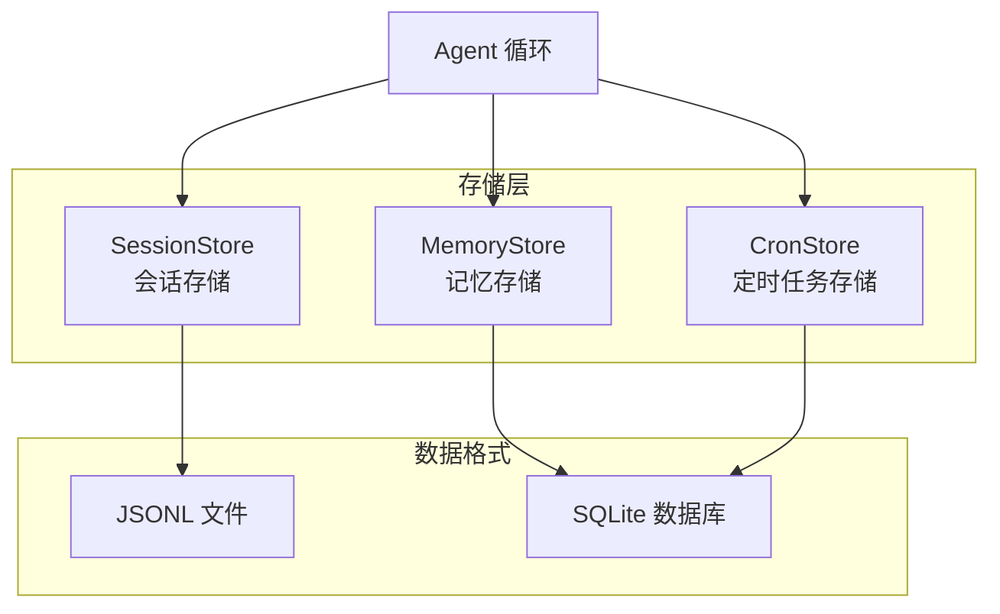

# Storage - 存储层

## 概述

存储层提供会话、记忆、定时任务的数据持久化。

## 存储架构



### 存储对比

| 类型 | 存储方式 | 用途 |
|------|----------|------|
| 会话 | JSONL 文件 | 对话历史 |
| 记忆 | SQLite | 长期记忆 |
| 定时任务 | SQLite | 任务配置 |

## 会话存储

JSONL 格式存储会话历史。

```typescript
import { SessionStore } from '@microbot/sdk/storage';

const store = new SessionStore('~/.microbot/data/sessions.db');

// 添加消息
store.addMessage('channel:chatId', 'user', '你好');
store.addMessage('channel:chatId', 'assistant', '你好');

// 获取会话
const session = store.get('channel:chatId');
```

## 记忆存储

SQLite 数据库存储长期记忆。

```typescript
import { MemoryStore } from '@microbot/sdk/storage';

// 添加记忆
await memoryStore.add('关键词', '记忆内容');

// 搜索记忆
const memories = await memoryStore.search('查询内容');

// 获取所有记忆
const all = await memoryStore.getAll();
```

## 定时任务存储

SQLite 存储定时任务配置。

```typescript
import { CronStore } from '@microbot/sdk/storage';

// 添加任务
await cronStore.add({
  id: 'my-task',
  schedule: '0 9 * * *',
  enabled: true,
  action: 'say_hello',
});

// 获取任务
const tasks = await cronStore.getAll();
```

## 源码位置

- 会话: `packages/core/src/storage/session/store.ts`
- 记忆: `packages/core/src/storage/memory/store.ts`
- 定时任务: `packages/core/src/storage/cron/store.ts`
