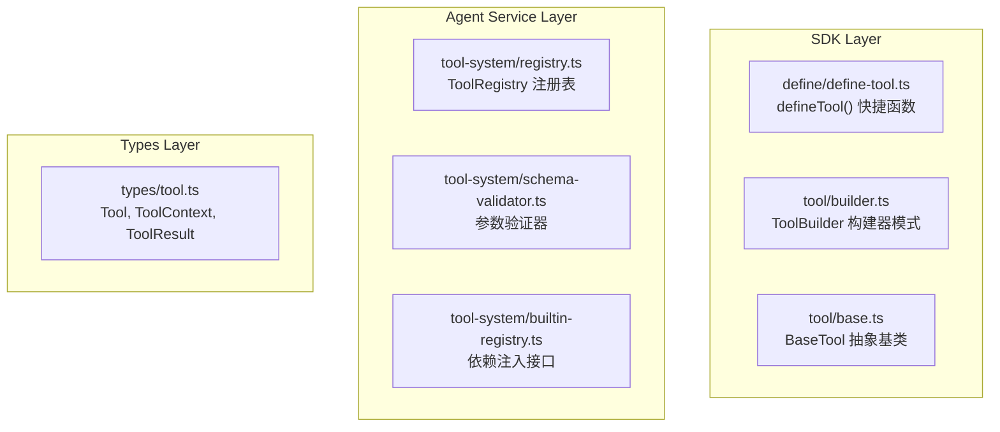

# 工具系统

MicroAgent 的工具系统允许 LLM 调用外部功能，实现与真实世界的交互。

## 架构



## 工具定义方式

### 方式一：defineTool() 快捷函数

```typescript
import { defineTool } from '@micro-agent/sdk';

export const myTool = defineTool({
  name: 'my_tool',
  description: `我的自定义工具。

**使用场景**：
- 场景一描述
- 场景二描述`,
  inputSchema: {
    type: 'object',
    properties: {
      message: { type: 'string', description: '输入消息' },
    },
    required: ['message'],
  },
  examples: [
    { description: '基本用法', input: { message: 'Hello' } },
  ],
  execute: async (input, ctx) => {
    return `处理结果: ${input.message}`;
  },
});
```

### 方式二：ToolBuilder 构建器模式

```typescript
import { createToolBuilder } from '@micro-agent/sdk';

const tool = createToolBuilder()
  .name('my_tool')
  .description('工具描述')
  .inputSchema({
    type: 'object',
    properties: {
      message: { type: 'string' },
    },
  })
  .execute(async (input, ctx) => '结果')
  .build();
```

### 方式三：继承 BaseTool

```typescript
import { BaseTool } from '@micro-agent/sdk';

class MyTool extends BaseTool<MyInput> {
  readonly name = 'my_tool';
  readonly description = '工具描述';
  readonly inputSchema = {
    type: 'object',
    properties: {
      message: { type: 'string' },
    },
  };
  
  async execute(input: MyInput, context: ToolContext): Promise<ToolResult> {
    return { content: [{ type: 'text', text: '结果' }] };
  }
}
```

## 工具接口

```typescript
interface Tool {
  readonly name: string;
  readonly description: string;
  readonly inputSchema: JSONSchema;
  examples?: ToolExample[];
  execute(input: unknown, ctx: ToolContext): Promise<ToolResult>;
}

interface ToolContext {
  sessionId: string;
  workspace: string;
  abortSignal?: AbortSignal;
  log: (message: string) => void;
}

interface ToolResult {
  content: Array<{ type: 'text' | 'image'; text?: string; data?: string }>;
  isError?: boolean;
}
```

## 工具注册表

```typescript
class ToolRegistry {
  // 注册工具
  register(tool: Tool): void;
  
  // 注销工具
  unregister(name: string): void;
  
  // 获取工具
  get(name: string): Tool | undefined;
  
  // 检查存在
  has(name: string): boolean;
  
  // 执行工具
  execute(name: string, input: unknown, ctx: ToolContext): Promise<string>;
  
  // 获取 LLM 定义
  getDefinitions(): ToolDefinition[];
}
```

## 参数验证

工具系统自动验证 inputSchema，支持：

| 规则 | 说明 |
|------|------|
| `type` | 类型检查 |
| `enum` | 枚举值 |
| `minLength/maxLength` | 字符串长度 |
| `min/max` | 数值范围 |
| `pattern` | 正则匹配 |
| `required` | 必填字段 |
| `default` | 默认值 |

## 内置工具

| 工具名 | 功能 | 安全特性 |
|--------|------|----------|
| `read` | 读取文件内容 | 路径验证、禁止访问 node_modules |
| `write` | 创建或覆盖文件 | 目录自动创建、路径验证 |
| `exec` | 执行 Shell 命令 | 危险命令黑名单、环境变量过滤 |
| `glob` | 文件模式匹配 | 跳过隐藏文件和常见忽略目录 |
| `grep` | 内容正则搜索 | 限制最大匹配数 |
| `edit` | 精确文件编辑 | 精确匹配校验 |
| `list_directory` | 列出目录内容 | 支持 .gitignore 规则 |
| `todo_write` | 任务列表管理 | 按会话隔离存储 |
| `todo_read` | 读取任务列表 | - |
| `ask_user` | 用户交互提问 | 问题/选项数量限制 |

## 安全机制

### 危险命令黑名单

```typescript
const BLOCKED_COMMANDS = [
  'shutdown', 'reboot', 'halt', 'poweroff',
  'useradd', 'userdel', 'passwd',
  'sudo', 'su', 'doas',
  'mkfs', 'fdisk', 'dd',
  'iptables', 'ip6tables',
];
```

### 危险模式检测

```typescript
const DANGEROUS_PATTERNS = [
  /\brm\s+-rf\s+\//i,        // rm -rf /
  /\brm\s+-rf\s+~/i,        // rm -rf ~
  /\$\(.*\)/i,              // 命令替换
  /`.*`/i,                  // 反引号命令
  /\|\s*(sh|bash|zsh)/i,    // 管道到 shell
];
```

## 依赖注入

通过 `BuiltinToolProvider` 接口实现依赖注入，解耦 Agent Service 和 Applications。

```typescript
// Agent Service 定义接口
interface BuiltinToolProvider {
  getTool(name: string): Tool | undefined;
  listTools(): ToolDefinition[];
}

// Applications 注册实现
registerBuiltinToolProvider({
  getTool: (name) => tools.get(name),
  listTools: () => Array.from(tools.values()),
});

// Agent Service 获取实现
const provider = getBuiltinToolProvider();
const tool = provider?.getTool('read');
```

## 结构化错误

```typescript
enum ToolErrorType {
  INVALID_PARAMS = 'invalid_params',
  EXECUTION_ERROR = 'execution_error',
  TIMEOUT = 'timeout',
  NOT_FOUND = 'not_found',
  PERMISSION_DENIED = 'permission_denied',
  ABORTED = 'aborted',
}

interface ToolError {
  type: ToolErrorType;
  message: string;
  details?: Record<string, unknown>;
}
```