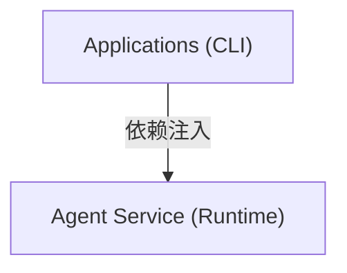
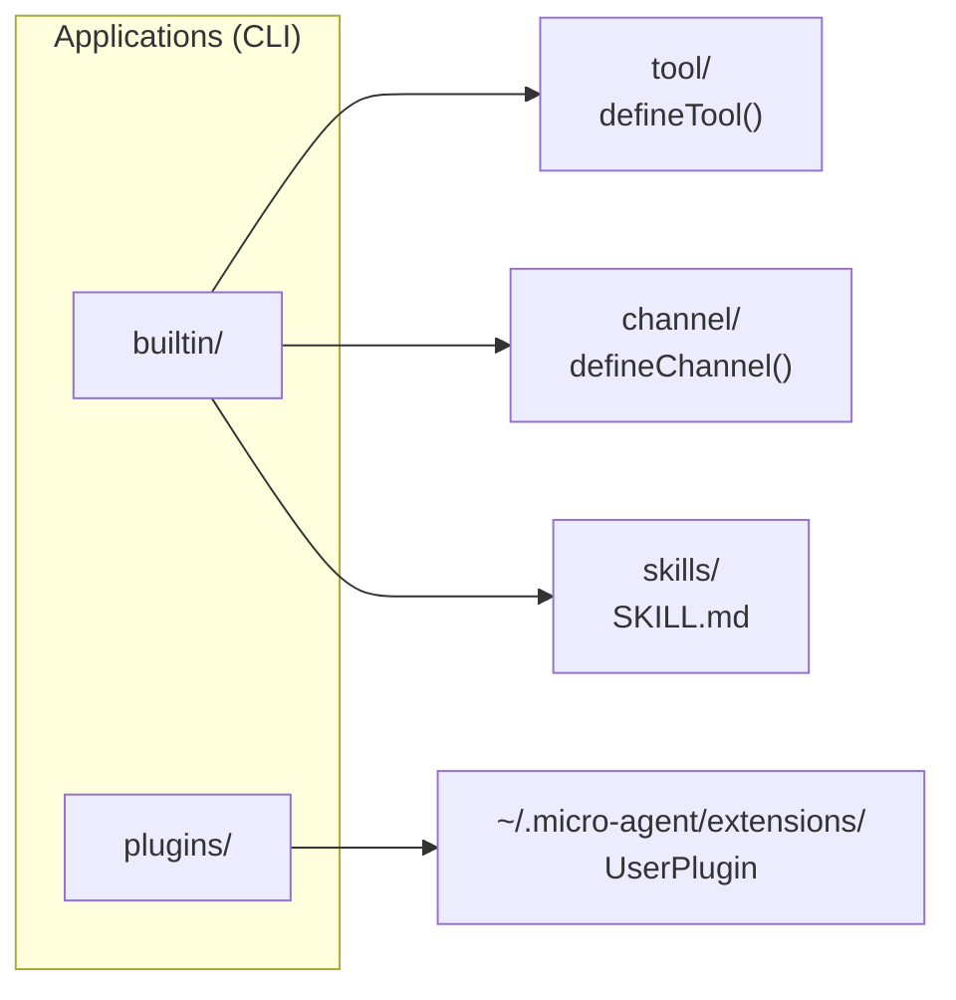
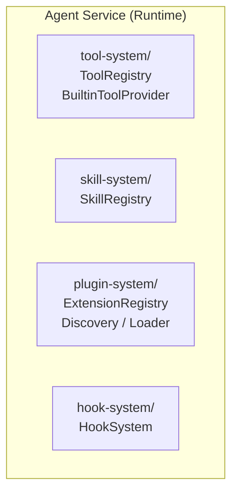

# 扩展概述

MicroAgent 采用插件式扩展架构，支持四种主要扩展类型：工具、技能、通道、插件。

## 扩展架构

### 整体架构



### Applications 层扩展



### Agent Service 层注册表



## 扩展类型对比

| 特性 | 工具 (Tool) | 技能 (Skill) | 通道 (Channel) | 插件 (Plugin) |
|------|-------------|--------------|----------------|---------------|
| **定义方式** | `defineTool()` | SKILL.md | `defineChannel()` | UserPlugin 接口 |
| **主要用途** | LLM 可调用操作 | 领域知识/提示词 | 消息收发 | 功能扩展 |
| **加载时机** | 启动时注册 | 按需/自动加载 | 启动时启动 | 发现后激活 |
| **执行主体** | LLM 决定调用 | 注入系统提示 | 消息总线驱动 | 事件/命令触发 |
| **依赖注入** | BuiltinToolProvider | BuiltinSkillProvider | 直接实例化 | ExtensionContext |
| **存储位置** | applications/cli/src/builtin/tool | applications/cli/src/builtin/skills | applications/cli/src/builtin/channel | ~/.micro-agent/extensions |
| **适用场景** | 文件操作、命令执行 | 文档处理、时间计算 | IM 集成、Webhook | CLI 命令、事件处理 |

## 工具扩展

### 定义方式

```typescript
import { defineTool } from '@micro-agent/sdk';

export const myTool = defineTool({
  name: 'my_tool',
  description: `我的自定义工具。

**使用场景**：
- 场景一描述
- 场景二描述`,
  inputSchema: {
    type: 'object',
    properties: {
      message: { type: 'string', description: '输入消息' },
    },
    required: ['message'],
  },
  examples: [
    { description: '基本用法', input: { message: 'Hello' } },
  ],
  execute: async (input, ctx) => {
    return `处理结果: ${input.message}`;
  },
});
```

### 关键特性

- **MCP 兼容**: 遵循 Model Context Protocol 的 Tool 原语规范
- **参数验证**: 自动验证 inputSchema，失败返回结构化错误
- **结构化错误**: 提供 `ToolErrorType` 分类错误

### 内置工具

| 工具名 | 功能 |
|--------|------|
| read | 读取文件内容 |
| write | 创建或覆盖文件 |
| exec | 执行 Shell 命令 |
| glob | 文件模式匹配 |
| grep | 内容正则搜索 |
| edit | 精确文件编辑 |
| list_directory | 列出目录内容 |
| todo_write | 任务列表管理 |
| todo_read | 读取任务列表 |
| ask_user | 用户交互提问 |

## 技能扩展

### 定义方式 (SKILL.md)

```markdown
---
name: time
description: 时间处理工具 - 获取时间、时区转换、时间差计算
dependencies:
  - bun>=1.0
compatibility: bun
always: true
allowed-tools: []
---

# 时间处理工具

技能内容（Markdown 格式）...
```

### 元数据字段

| 字段 | 类型 | 说明 |
|------|------|------|
| name | string | 技能名称（kebab-case） |
| description | string | 技能描述 |
| dependencies | string[] | 依赖包 |
| always | boolean | 是否自动注入上下文 |
| allowed-tools | string[] | 允许使用的工具列表 |

### 加载优先级

```
1. builtin/           (内置技能)
2. ~/.micro-agent/skills/  (用户技能)
3. {workspace}/skills/     (项目技能)
```

### 内置技能

| 技能名 | 功能 |
|--------|------|
| time | 时间处理工具 |
| sysinfo | 系统信息技能 |
| pdf | PDF 文档处理 |
| docx | Word 文档处理 |
| xlsx | Excel 处理 |
| pptx | PowerPoint 处理 |
| doc-coauthoring | 文档协作技能 |
| skill-creator | 技能创建工具 |

## 通道扩展

### 定义方式

```typescript
import { defineChannel } from '@micro-agent/sdk';

export const myChannel = defineChannel({
  name: 'my-channel' as ChannelType,
  start: async () => { 
    // 初始化连接
  },
  stop: async () => { 
    // 关闭连接
  },
  send: async (msg: OutboundMessage) => { 
    // 发送消息
  },
});
```

### Channel 接口

```typescript
interface Channel {
  readonly name: ChannelType;
  readonly isRunning: boolean;
  start(): Promise<void>;
  stop(): Promise<void>;
  send(msg: OutboundMessage): Promise<void>;
}
```

### 内置通道

| 通道名 | 功能 |
|--------|------|
| feishu | 飞书机器人 |

## 插件扩展

### 定义方式

```typescript
const myPlugin: UserPlugin = {
  id: 'my-plugin',
  name: '我的插件',
  version: '1.0.0',
  activate: (context: PluginContext) => {
    // 注册命令
    context.registerCommand({
      id: 'cmd',
      name: '命令',
      handler: async () => { /* ... */ },
    });
    // 注册钩子
    context.registerHook({
      event: 'message:received',
      handler: async (data) => { /* ... */ },
    });
  },
  deactivate: () => {
    // 清理资源
  },
};
```

### PluginContext 接口

```typescript
interface PluginContext {
  pluginDir: string;
  homeDir: string;
  workspace: string;
  registerCommand: (command: PluginCommand) => void;
  registerHook: (hook: PluginHook) => void;
  log: (level: LogLevel, message: string) => void;
}
```

## 钩子系统

### 钩子类型

| 钩子 | 触发时机 |
|------|----------|
| pre:inbound | 消息入站前 |
| post:inbound | 消息入站后 |
| pre:outbound | 消息出站前 |
| post:outbound | 消息出站后 |
| pre:tool | 工具执行前 |
| post:tool | 工具执行后 |
| pre:llm | LLM 调用前 |
| post:llm | LLM 调用后 |

### 使用方式

```typescript
hookSystem.registerHook('pre:tool', async (ctx) => {
  // 处理逻辑
  return { data: ctx.data, stop: false };
}, 100); // 优先级（越小越先执行）
```

## 清单文件

扩展通过清单文件描述：

```yaml
# extension.yaml
id: my-extension
name: My Extension
version: 1.0.0
type: tool
description: 扩展描述
main: index.ts
dependencies:
  - bun>=1.0
```

支持的清单文件名（按优先级）：
- `extension.yaml`
- `extension.yml`
- `extension.json`
- `package.json`（需包含 `microAgent` 字段）

## 热重载

```typescript
interface HotReloadConfig {
  enabled: boolean;        // 是否启用（默认 true）
  debounceMs: number;      // 防抖延迟（默认 1000ms）
  gracefulTimeout: number; // 优雅等待超时（默认 30000ms）
}
```

热重载会等待当前活动调用完成后再重载，超时后强制重载。