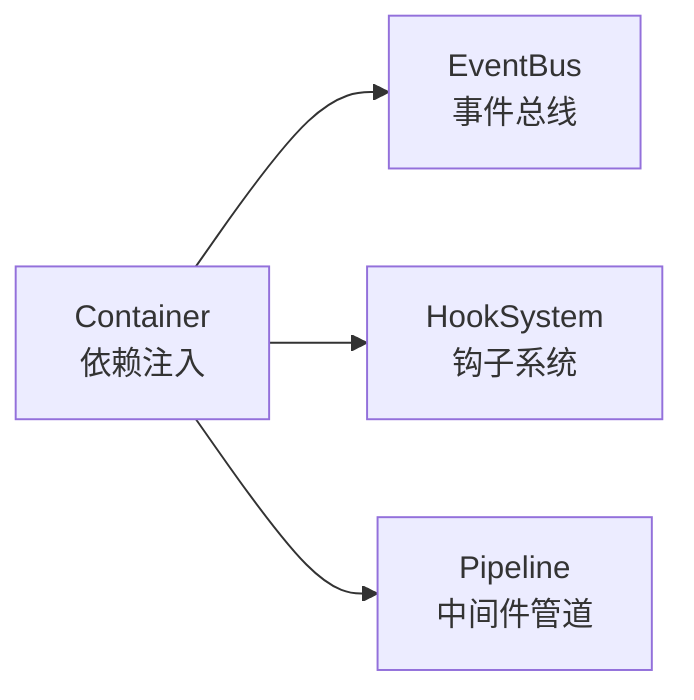
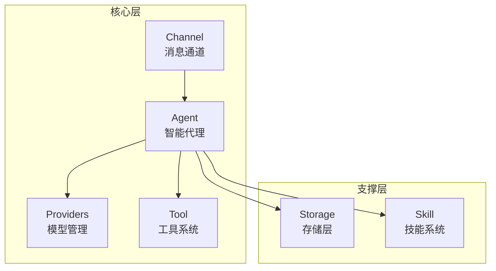
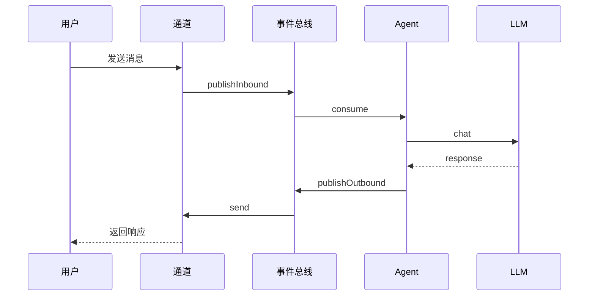
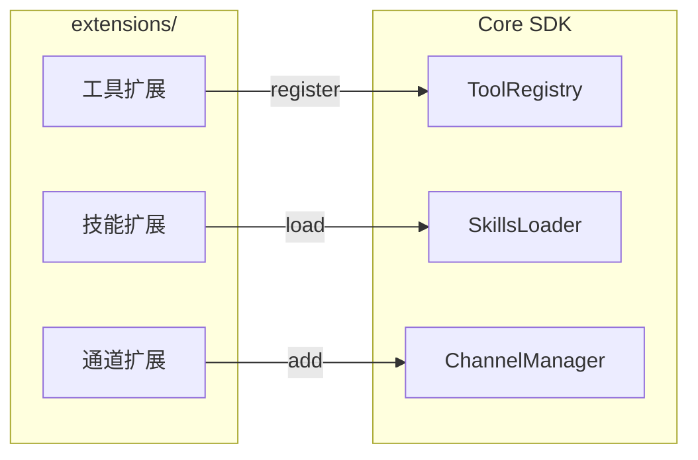

# 架构概述

## 设计原则

### 1. 代码即文档

类型系统自解释，命名语义化，避免隐式逻辑。

```typescript
// ✅ 类型即文档
interface Tool {
  readonly name: string;
  readonly description: string;
  readonly inputSchema: ZodSchema;
  execute(input: unknown, ctx: ToolContext): Promise<unknown>;
}
```

### 2. 组合优于继承

通过接口 + 事件总线解耦，避免继承链导致的循环依赖。

```typescript
// ✅ 组合 + 事件总线解耦
class FeishuChannel implements Channel {
  constructor(private eventBus: EventBus) {
    this.eventBus.on('message:outbound', this.send.bind(this));
  }
}
```

### 3. 开放封闭原则

对扩展开放，对修改封闭。使用注册表模式实现插件式扩展。

```typescript
class ToolRegistry {
  private tools = new Map<string, Tool>();
  
  register(tool: Tool): void {
    this.tools.set(tool.name, tool);
  }
}
```

### 4. 轻量化设计

最小依赖，最小抽象，无过度工程。

| 约束 | 阈值 |
|------|------|
| 单文件行数 | ≤ 300 行 |
| 单方法行数 | ≤ 25 行 |
| 方法嵌套层级 | ≤ 3 层 |
| 方法参数 | ≤ 4 个 |

### 5. 本地优先

默认本地存储和隐私保护，无云存储依赖。

| 数据 | 存储 |
|------|------|
| 会话 | JSONL |

## 模块架构

### Core 模块概览



### 核心模块关系



### 消息流向



### 扩展机制



### 目录结构

```
packages/
├── types/              # L1: 核心类型定义（MCP 兼容）
├── runtime/            # L2: 运行时引擎（Container、EventBus、HookSystem）
├── config/             # L2: 三级配置系统
├── storage/            # L2: 会话存储
├── sdk/                # L3: 聚合 SDK，统一开发接口
├── providers/          # L3: LLM Provider 抽象
├── extension-system/   # L3: 扩展发现、加载、热重载
└── server/             # L4: 服务层（Channel、Queue、Events）
```

## 扩展机制

| 机制 | 用途 | 示例 |
|------|------|------|
| 依赖注入 | 解耦组件 | `container.resolve<ToolRegistry>()` |
| 事件系统 | 松耦合通信 | `eventBus.on('tool:beforeExecute')` |
| 注册表模式 | 动态注册扩展 | `toolRegistry.register(new MyTool())` |
