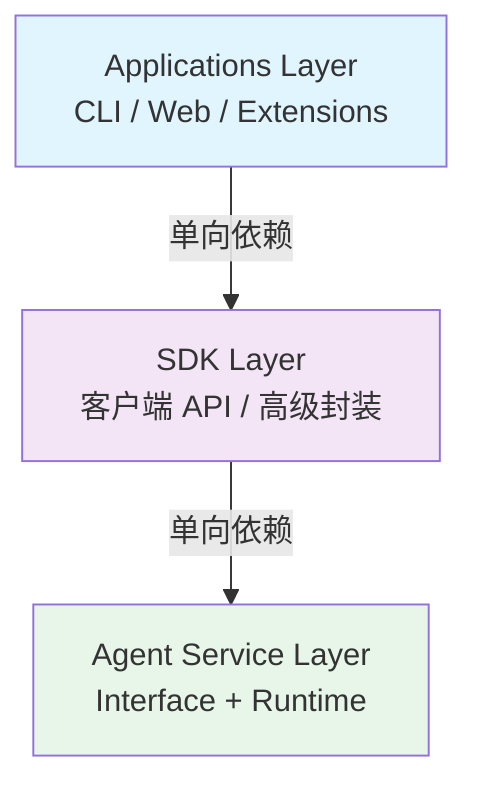
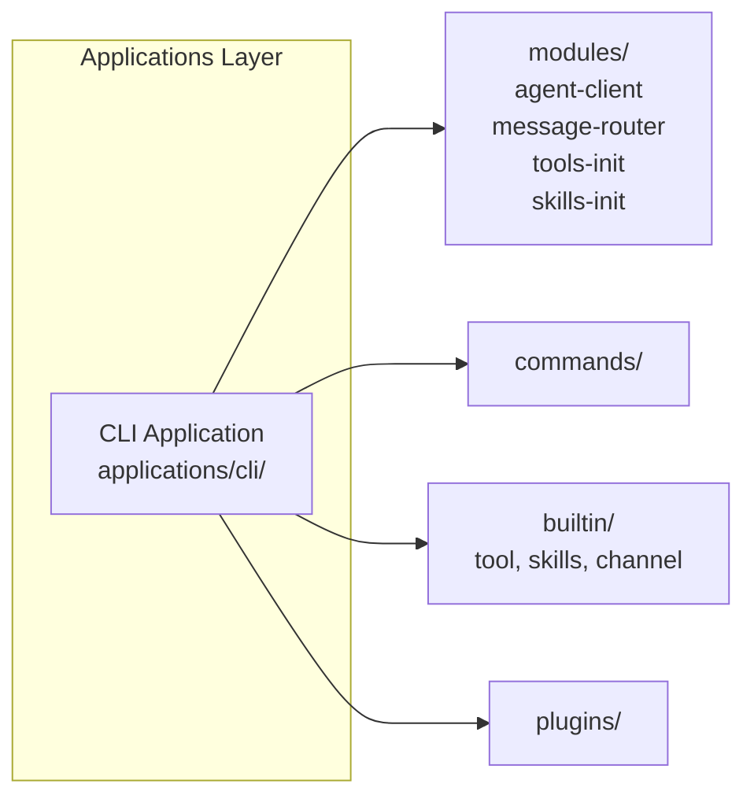
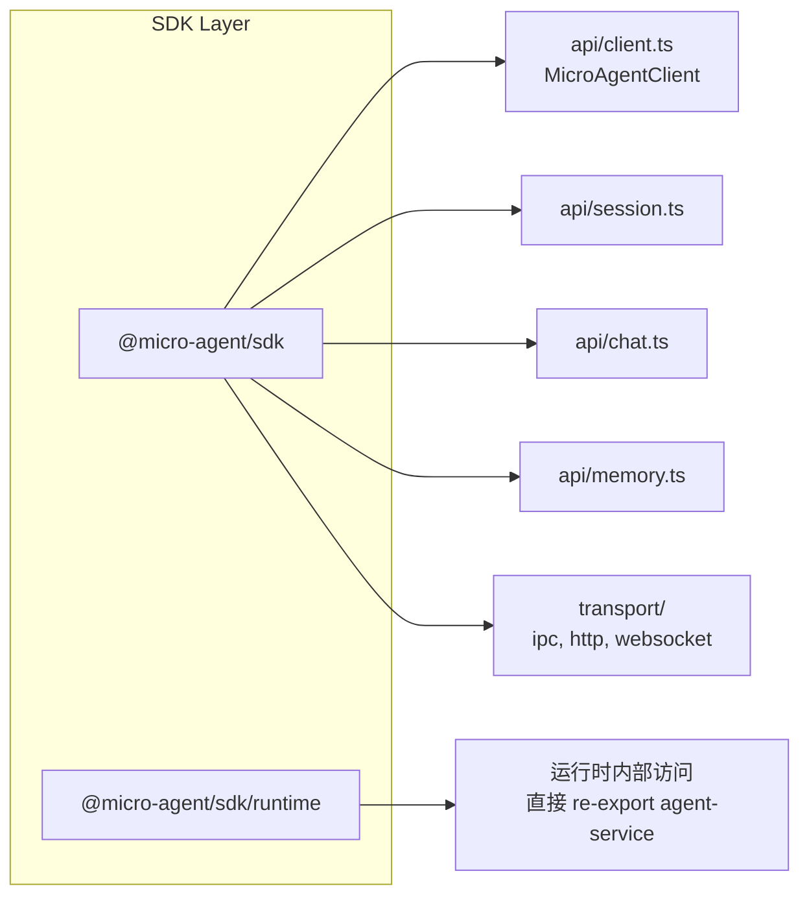
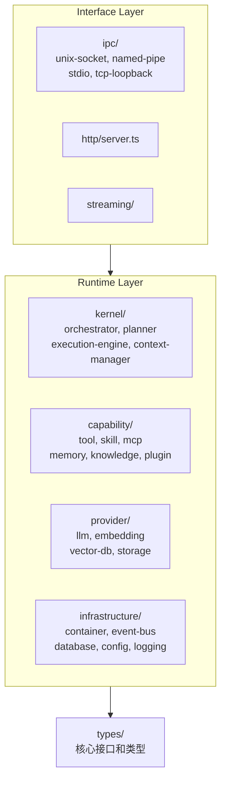
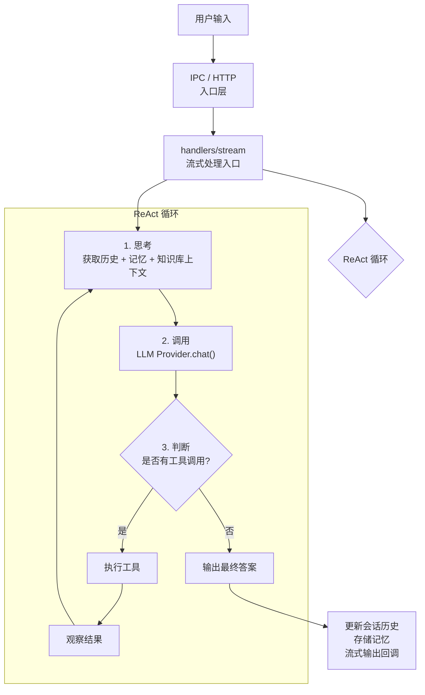
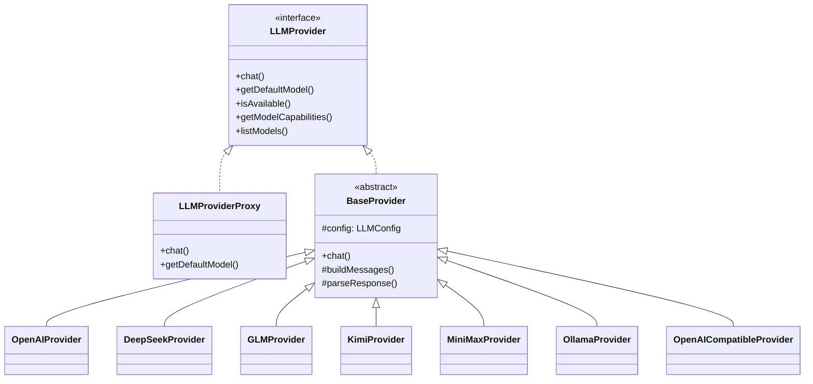

# 架构概述

MicroAgent 采用三层架构设计，遵循单向依赖原则，实现清晰的关注点分离。

## 三层架构

MicroAgent 采用三层架构设计，遵循单向依赖原则。

### 整体依赖关系


```mermaid
flowchart TB
    APP["Applications Layer<br/>CLI / Web / Extensions"]
    SDK["SDK Layer<br/>客户端 API / 高级封装"]
    AS["Agent Service Layer<br/>Interface + Runtime"]
    
    APP -->|"单向依赖"| SDK
    SDK -->|"单向依赖"| AS
    
    style APP fill:#e1f5fe
    style SDK fill:#f3e5f5
    style AS fill:#e8f5e9
```

### Applications Layer


```mermaid
flowchart LR
    subgraph APP["Applications Layer"]
        direction TB
        CLI["CLI Application<br/>applications/cli/"]
    end
    
    CLI --> MODULES["modules/<br/>agent-client<br/>message-router<br/>tools-init<br/>skills-init"]
    CLI --> CMD["commands/"]
    CLI --> BUILTIN["builtin/<br/>tool, skills, channel"]
    CLI --> PLUGINS["plugins/"]
```

### SDK Layer


```mermaid
flowchart LR
    subgraph SDK["SDK Layer"]
        API["@micro-agent/sdk"]
        RUNTIME["@micro-agent/sdk/runtime"]
    end
    
    API --> CLIENT["api/client.ts<br/>MicroAgentClient"]
    API --> SESSION["api/session.ts"]
    API --> CHAT["api/chat.ts"]
    API --> MEMORY["api/memory.ts"]
    API --> TRANSPORT["transport/<br/>ipc, http, websocket"]
    
    RUNTIME --> RT_DESC["运行时内部访问<br/>直接 re-export agent-service"]
```

### Agent Service Layer


```mermaid
flowchart TB
    subgraph IF["Interface Layer"]
        IPC["ipc/<br/>unix-socket, named-pipe<br/>stdio, tcp-loopback"]
        HTTP["http/server.ts"]
        STREAM["streaming/"]
    end
    
    subgraph RT["Runtime Layer"]
        KERNEL["kernel/<br/>orchestrator, planner<br/>execution-engine, context-manager"]
        CAP["capability/<br/>tool, skill, mcp<br/>memory, knowledge, plugin"]
        PROV["provider/<br/>llm, embedding<br/>vector-db, storage"]
        INFRA["infrastructure/<br/>container, event-bus<br/>database, config, logging"]
    end
    
    TYPES["types/<br/>核心接口和类型"]
    
    IF --> RT
    RT --> TYPES
```

## 设计原则

### 1. 单向依赖原则

**规则**: Applications → SDK → Agent Service

**绝对禁止反向依赖**，通过以下机制实现：

#### 模块隔离

```typescript
// ✅ Applications 只从 SDK 导入
import { createClient, registerBuiltinToolProvider } from '@micro-agent/sdk';

// ❌ 禁止直接导入 Agent Service
import { ... } from '../agent-service/...';
```

#### 依赖注入反转

```typescript
// Agent Service 定义接口（不依赖具体实现）
interface BuiltinToolProvider {
  getTool(name: string): Tool | undefined;
  listTools(): ToolDefinition[];
}

// Applications 实现接口并注册
const provider: BuiltinToolProvider = {
  getTool: (name) => tools.get(name),
  listTools: () => Array.from(tools.values()),
};
registerBuiltinToolProvider(provider);

// Agent Service 运行时获取实现
const provider = getBuiltinToolProvider();
```

### 2. 代码即文档

类型系统自解释，命名语义化，避免隐式逻辑。

```typescript
// ✅ 类型即文档
interface Tool {
  readonly name: string;
  readonly description: string;
  readonly inputSchema: JSONSchema;
  execute(input: unknown, ctx: ToolContext): Promise<ToolResult>;
}
```

### 3. 组合优于继承

通过接口 + 事件总线解耦，避免继承链导致的循环依赖。

```typescript
// ✅ 组合 + 事件总线解耦
class FeishuChannel implements Channel {
  constructor(private eventBus: EventBus) {
    this.eventBus.on('message:outbound', this.send.bind(this));
  }
}
```

### 4. 开放封闭原则

对扩展开放，对修改封闭。使用注册表模式实现插件式扩展。

```typescript
class ToolRegistry {
  private tools = new Map<string, Tool>();
  
  register(tool: Tool): void {
    this.tools.set(tool.name, tool);
  }
}
```

### 5. 轻量化设计

最小依赖，最小抽象，无过度工程。

| 约束 | 阈值 |
|------|------|
| 单文件行数 | ≤ 300 行 |
| 单方法行数 | ≤ 25 行 |
| 方法嵌套层级 | ≤ 3 层 |
| 方法参数 | ≤ 4 个 |

## 核心依赖注入点

### 1. Container（通用依赖注入容器）

```typescript
// agent-service/runtime/infrastructure/container.ts
class ContainerImpl implements Container {
  register<T>(token, factory)    // 注册瞬态工厂
  singleton<T>(token, factory)   // 注册单例工厂
  resolve<T>(token)              // 解析依赖
  has(token)                     // 检查是否已注册
}
```

### 2. BuiltinToolProvider（工具提供者注册）

```typescript
// 解决 Agent Service 不能直接依赖 Applications 中的工具实现
registerBuiltinToolProvider(provider)  // 上层应用注册工具实现
getBuiltinToolProvider()               // Agent Service 获取工具提供者
```

### 3. BuiltinSkillProvider（技能提供者注册）

```typescript
// 解决 Agent Service 不能直接依赖 Applications 中的技能实现
registerBuiltinSkillProvider(provider)  // 上层应用注册技能实现
getBuiltinSkillProvider()               // Agent Service 获取技能提供者
```

### 4. EventBus（事件总线 - 模块间解耦通信）

```typescript
// agent-service/runtime/infrastructure/event-bus.ts
eventBus.on(event, handler)      // 订阅事件
eventBus.off(event, handler)     // 取消订阅
eventBus.emit(event, payload)    // 触发事件
eventBus.once(event, handler)    // 一次性订阅
```

## 消息处理流程


```mermaid
flowchart TB
    USER["用户输入"] --> ENTRY["IPC / HTTP<br/>入口层"]
    ENTRY --> STREAM["handlers/stream<br/>流式处理入口"]
    
    STREAM --> REACT{"ReAct 循环"}
    
    subgraph REACT_LOOP["ReAct 循环"]
        THINK["1. 思考<br/>获取历史 + 记忆 + 知识库上下文"]
        CALL["2. 调用<br/>LLM Provider.chat()"]
        CHECK{"3. 判断<br/>是否有工具调用?"}
        EXEC["执行工具"]
        OBSERVE["观察结果"]
        OUTPUT["输出最终答案"]
        
        THINK --> CALL --> CHECK
        CHECK -->|"是"| EXEC --> OBSERVE --> THINK
        CHECK -->|"否"| OUTPUT
    end
    
    STREAM --> THINK
    
    OUTPUT --> UPDATE["更新会话历史<br/>存储记忆<br/>流式输出回调"]
```

## Provider 多模型适配

### 架构


```mermaid
classDiagram
    class LLMProvider {
        <<interface>>
        +chat()
        +getDefaultModel()
        +isAvailable()
        +getModelCapabilities()
        +listModels()
    }
    
    class LLMProviderProxy {
        +chat()
        +getDefaultModel()
    }
    
    class BaseProvider {
        <<abstract>>
        #config: LLMConfig
        +chat()
        #buildMessages()
        #parseResponse()
    }
    
    class OpenAIProvider
    class DeepSeekProvider
    class GLMProvider
    class KimiProvider
    class MiniMaxProvider
    class OllamaProvider
    class OpenAICompatibleProvider
    
    LLMProvider <|.. LLMProviderProxy
    LLMProvider <|.. BaseProvider
    BaseProvider <|-- OpenAIProvider
    BaseProvider <|-- DeepSeekProvider
    BaseProvider <|-- GLMProvider
    BaseProvider <|-- KimiProvider
    BaseProvider <|-- MiniMaxProvider
    BaseProvider <|-- OllamaProvider
    BaseProvider <|-- OpenAICompatibleProvider
```

### 厂商检测

```typescript
// 根据 URL 域名和模型名称自动检测
detectVendor(baseUrl, model) → 'openai' | 'deepseek' | 'glm' | 'kimi' | 'minimax' | 'ollama' | 'openai-compatible'
```

### 思考模型支持

| 厂商 | 思考模型 | 参数设置 |
|------|----------|----------|
| OpenAI | o1, o3 系列 | `reasoning_effort: 'high'` |
| DeepSeek | deepseek-reasoner, deepseek-r1 | `thinking: { type: 'enabled' }` |
| GLM | glm-4-plus, glm-5 | `enable_cot: true` |
| Kimi | kimi-k2 | `reasoning: { effort: 'high' }` |
| MiniMax | m2.x 系列 | `thinking: { type: 'enabled' }` |

### 模型路由器

```typescript
// 根据任务类型选择模型
router.selectByTaskType('vision')  // 视觉任务
router.selectByTaskType('coder')   // 编程任务
router.selectByTaskType('chat')    // 对话任务
```

## 性能目标

| 指标 | 目标值 |
|------|--------|
| HTTP QPS | 1000+ |
| 响应延迟 P95 | <500ms |
| 流式首字节 TTFT | <1s |
| 并发会话 | 100+ |