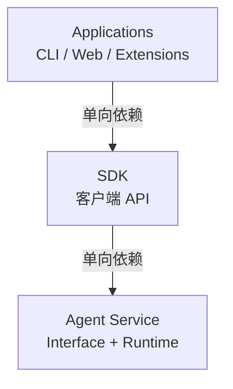
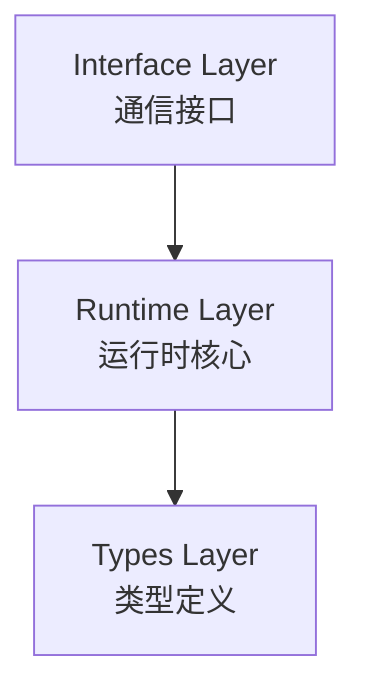
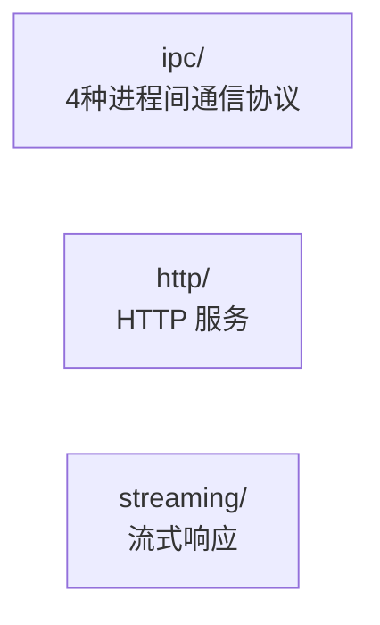
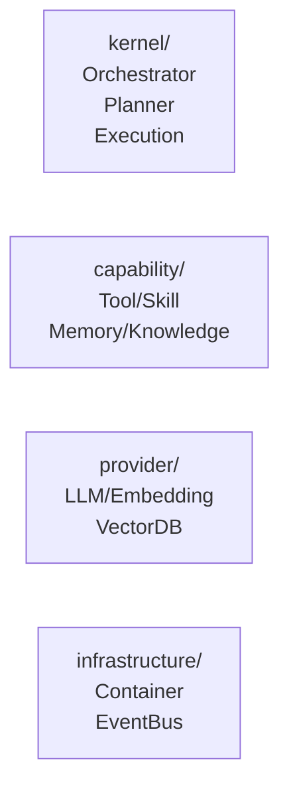

# v0.3.0

**发布日期**: 2026-03-10

架构重构版本，全新的三层架构设计。

## 架构重构

### 三层架构

项目从 `packages/` + `apps/` 结构迁移到三层架构，实现清晰的职责分离。

#### 整体依赖关系



#### 各层职责

| 层级 | 职责 | 可引入第三方库 |
|------|------|---------------|
| Applications | CLI、Web、配置管理、提示词模板 | ✓ |
| SDK | 客户端 API、高级能力封装 | ✓ |
| Agent Service | Interface Layer + Runtime Layer | ✗ |

#### 目录结构变更

| 旧位置 | 新位置 |
|--------|--------|
| `packages/core/` | `agent-service/runtime/` |
| `packages/providers/` | `agent-service/runtime/provider/` |
| `packages/storage/` | `agent-service/runtime/infrastructure/` |
| `apps/cli/` | `applications/cli/` |
| `extensions/` | `applications/cli/src/builtin/` |

### Agent Service 内部分层

#### 整体结构



#### Interface Layer



#### Runtime Layer



### 依赖注入

通过 `BuiltinToolProvider` 和 `BuiltinSkillProvider` 接口实现反向依赖注入，解耦 Agent Service 与 Applications。

```typescript
// Applications 层注册实现
registerBuiltinToolProvider({ getTools, listTools });
registerBuiltinSkillProvider({ getSkillsPath });

// Agent Service 层获取实现
const provider = getBuiltinToolProvider();
```

## Kernel 核心

### Orchestrator 编排器

ReAct 循环的核心实现，协调思考-行动-观察的完整流程。

- **ReAct 循环** - 思考 → 行动 → 观察的迭代执行
- **困惑检测** - 连续 3 次工具调用失败时自动降级
- **流式状态回调** - 支持 `thinking`、`executing`、`observing`、`completed` 状态通知
- **中止机制** - 支持中断当前执行

### Blackboard 黑板

多阶段数据共享中心，实现状态管理和回滚。

- **快照机制** - `createSnapshot()` / `restoreFromSnapshot()` 状态回滚
- **工具结果缓存** - 避免重复执行相同工具
- **迭代控制** - 防止无限循环

### Planner 规划器

任务分解与执行计划生成。

- **TaskDecomposer** - 使用 LLM 将复杂任务分解为子任务
- **PlanGenerator** - 拓扑排序生成执行顺序
- **并行识别** - 自动识别无依赖的可并行任务

### ExecutionEngine 执行引擎

工具执行与结果处理。

- **ToolExecutor** - 执行工具调用，支持语义匹配
- **ResultHandler** - 处理执行结果，生成汇总
- **中止支持** - `abort()` 方法可中断执行

### ContextManager 上下文管理器

Token 预算管理与上下文压缩。

- **TokenBudget** - Token 预算分配（系统/工具/上下文/RAG）
- **TokenEstimator** - 中英文智能 Token 估算（轻量级，无 tiktoken 依赖）
- **ContextBuilder** - 上下文构建和压缩（滑动窗口策略）
- **PreferenceInjector** - 用户偏好注入

## Provider 多厂商支持

### 支持的厂商

| 厂商 | Vision | Think | Tool | 特殊处理 |
|------|--------|-------|------|----------|
| OpenAI | 部分 | o1/o3 | 部分 | `reasoning_effort` 参数 |
| DeepSeek | - | R1/Reasoner | ✓ | `thinking` 参数，`reasoning_content` 响应 |
| GLM (智谱) | 部分 | glm-4-plus | ✓ | `enable_cot` 参数 |
| Kimi (Moonshot) | 部分 | kimi-thinking | ✓ | `reasoning.effort` 参数 |
| MiniMax | - | M2 系列 | ✓ | `thinking` + `groupId` |
| Ollama | 部分 | deepseek-r1 | ✓ | 自动解析 `<think/>` 标签 |
| OpenAI Compatible | 视模型 | 视模型 | ✓ | 通用适配 |

### 厂商自动检测

根据 URL 和模型名称自动识别厂商：

```typescript
// 域名检测
if (url.includes('deepseek.com')) return 'deepseek';
// 模型名称检测
if (model?.includes('r1')) return 'deepseek';
```

### 模型路由器

基于任务类型自动选择模型：

| 任务类型 | 选择策略 | Fallback |
|----------|----------|----------|
| vision | visionModel | 抛出错误 |
| coder | coderModel | chatModel |
| intent | intentModel | chatModel |

## Interface Layer

### IPC 通信

支持 4 种进程间通信协议：

| 协议 | 平台 | 特点 |
|------|------|------|
| stdio | 全平台 | 标准输入输出 |
| named-pipe | Windows | 命名管道 |
| unix-socket | Unix/Linux/macOS | Unix 域套接字 |
| tcp-loopback | 全平台 | TCP 回环 |

### JSON-RPC 2.0

标准的 RPC 协议实现：

- `methodHandlers` - 普通方法处理
- `streamHandlers` - 流式方法处理
- 完整的错误码支持

### HTTP Server

调试接口，提供以下端点：

| 端点 | 方法 | 说明 |
|------|------|------|
| `/health` | GET | 健康检查 |
| `/rpc` | POST | JSON-RPC 调用 |
| `/stream` | POST | SSE 流式响应 |

### SSE Streaming

Server-Sent Events 流式响应：

```typescript
interface StreamChunk {
  type: 'text' | 'tool_call' | 'thinking' | 'error' | 'done';
  content: string;
  timestamp: Date;
  metadata?: Record<string, unknown>;
}
```

## 记忆系统增强

### 检索模式

| 模式 | 触发条件 | 适用场景 |
|------|----------|----------|
| fulltext | 无嵌入模型 | 关键词精确匹配 |
| vector | 显式配置 | 语义相似检索 |
| hybrid | 有嵌入模型 + auto | 通用场景（推荐） |

### 混合检索

- **RRF 融合** - Reciprocal Rank Fusion 算法融合多源结果
- **时间衰减** - 基于艾宾浩斯遗忘曲线的时间评分
- **自动选择** - 根据配置自动选择最优检索模式

### SDK 高级功能

| 功能 | 说明 |
|------|------|
| 整合机制 | 消息阈值/空闲触发，压缩→提取→存储 |
| 遗忘引擎 | 遗忘曲线计算，清理候选识别 |
| AI 分类 | 规则 + LLM 双重分类，8 种记忆类型 |
| 重要性评分 | 访问频率 + 时间衰减 + 类型权重 |

### 嵌入模型迁移

支持无缝切换嵌入模型：

- 分批处理，进度追踪
- 自动回滚支持
- 增长控制 ≤20%

## 扩展系统

### 工具系统

内置 10 个核心工具：

| 工具 | 功能 |
|------|------|
| read | 读取文件内容 |
| write | 写入文件 |
| exec | 执行 Shell 命令 |
| glob | 文件模式匹配 |
| grep | 内容正则搜索 |
| edit | 精确编辑文件 |
| list_directory | 列出目录内容 |
| todo_write | 任务列表管理 |
| todo_read | 读取任务列表 |
| ask_user | 用户交互提问 |

### 技能系统

内置 8 个技能：time、sysinfo、docx、pdf、pptx、xlsx、doc-coauthoring、skill-creator

### 插件系统

- **热重载** - 文件变更自动重载，支持优雅关闭
- **扩展发现** - 自动扫描 `~/.micro-agent/extensions/`
- **生命周期管理** - activate/deactivate 钩子

### defineXxx API

```typescript
// 定义工具
defineTool({ name, description, inputSchema, execute });

// 定义技能
defineSkill({ name, description, content });

// 定义通道
defineChannel({ name, start, stop, send });
```

## SDK 全新引入

### MicroAgentClient

统一的客户端入口：

```typescript
const client = createClient({ transport: 'ipc' });
await client.connect();

// 流式聊天
for await (const chunk of client.chatStream({ ... })) {
  console.log(chunk);
}
```

### 传输层

| 传输 | 适用场景 |
|------|----------|
| IPC | CLI 工具、本地开发 |
| HTTP | 远程服务、Web 应用 |
| WebSocket | 实时应用、流式输出 |

### API 模块

| API | 功能 |
|-----|------|
| SessionAPI | 会话创建/管理/删除 |
| ChatAPI | 消息发送/历史管理 |
| MemoryAPI | 记忆检索/存储/删除 |
| ConfigAPI | 配置更新/热重载 |
| EmbeddingAPI | 嵌入模型管理/迁移 |

## 类型系统

### ChannelType 动态扩展

```typescript
// branded string 支持动态扩展
export type ChannelType = string & { readonly __brand: unique symbol };
export function createChannelType(name: string): ChannelType;
```

### Provider 能力定义

```typescript
interface ProviderCapabilities {
  vision: boolean;   // 视觉能力
  think: boolean;    // 推理能力
  tool: boolean;     // 工具调用
}
```

## 性能优化

### Token 估算

轻量级中英文智能估算，无需 tiktoken：

```typescript
interface TokenEstimatorConfig {
  charsPerTokenEn: number;     // 英文: ~4 字符/token
  charsPerTokenCn: number;     // 中文: ~1.5 字符/token
}
```

### 并发控制

- Subagent 并发上限 5 个
- 复杂任务拆分为独立子任务，多批次并行执行

## 依赖更新

| 包 | 版本 |
|-----|------|
| `ai` | ^6.0.116 |
| `@lancedb/lancedb` | ^0.26.2 |
| `@logtape/logtape` | ^2.0.4 |
| `zod` | ^4.3.6 |
| `mitt` | ^3.0.1 |

## 源码位置

- 架构核心: `agent-service/runtime/kernel/`
- Provider: `agent-service/runtime/provider/llm/providers/`
- Interface: `agent-service/interface/`
- 记忆系统: `agent-service/runtime/capability/memory/` + `sdk/src/memory/`
- SDK: `sdk/src/`
- 扩展: `applications/cli/src/builtin/`

## 升级指南

### 项目结构迁移

1. 更新导入路径：`@micro-agent/core` → `@micro-agent/sdk`
2. 运行时访问：从 `@micro-agent/sdk/runtime` 导入
3. 类型导入：从 `@micro-agent/agent-service/types` 或 `@micro-agent/sdk` 导入

### 配置迁移

```yaml
# 旧版本
providers:
  openai: { ... }

# 新版本（支持多厂商自动检测）
providers:
  openai: { baseUrl, apiKey, models }
  deepseek: { baseUrl, apiKey, models }
```

### API 变更

```typescript
// 旧版本
import { AgentExecutor } from '@micro-agent/core';

// 新版本
import { createClient } from '@micro-agent/sdk';
const client = createClient({ transport: 'ipc' });
```
