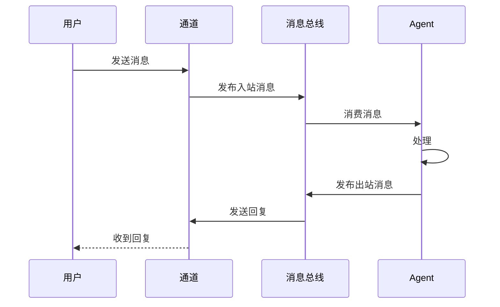
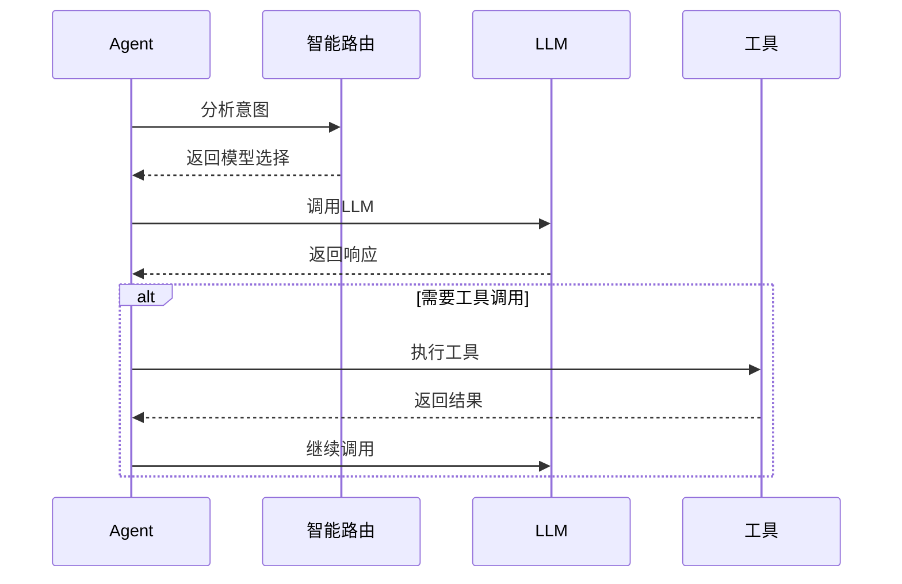
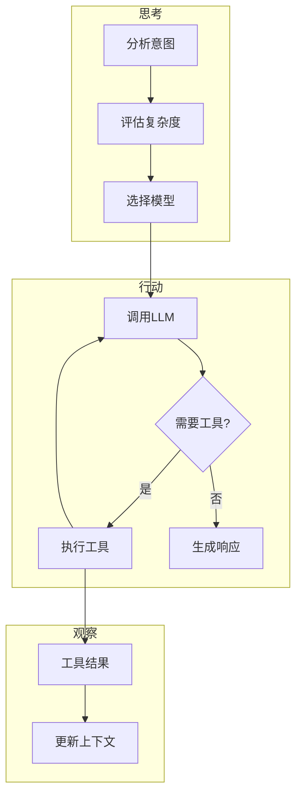

# 核心概念

## 整体流程

### 消息生命周期



### Agent 内部处理



## 依赖注入容器

Container 是 Microbot 的核心，提供依赖注入能力。

### 基本使用

```typescript
import { container } from '@microbot/sdk';

// 注册瞬态工厂
container.register('Provider', () => new OpenAIProvider());

// 注册单例
container.singleton('ToolRegistry', () => new ToolRegistry());

// 解析依赖
const provider = container.resolve<LLMProvider>('Provider');
```

## Provider 模式

Provider 抽象了 LLM 调用，支持多种后端。

### 接口定义

```typescript
interface LLMProvider {
  readonly name: string;
  
  chat(
    messages: LLMMessage[],
    tools?: LLMToolDefinition[],
    model?: string,
    config?: GenerationConfig
  ): Promise<LLMResponse>;
  
  getDefaultModel(): string;
  isAvailable(): Promise<boolean>;
}
```

### 支持的 Provider

- **OpenAI**: OpenAI API 兼容
- **Ollama**: 本地 LLM
- **自定义**: 实现 LLMProvider 接口

## Agent 循环

Agent 循环实现了 ReAct（Reasoning + Acting）模式。

### 主流程


### ReAct 详细流程



### 执行步骤

1. **接收用户消息** - 从通道获取输入
2. **构建上下文** - 加载记忆、技能、历史
3. **思考** - 分析意图，选择合适的模型
4. **行动** - 调用 LLM，执行工具
5. **观察** - 处理工具结果
6. **循环** - 重复直到完成任务
7. **保存会话** - 持久化对话历史

## 工具系统

工具是 Agent 与世界交互的桥梁。

### 定义工具

```typescript
import { z } from 'zod';
import { Tool } from '@microbot/sdk';

class FileReadTool extends Tool {
  readonly name = 'read_file';
  readonly description = '读取文件内容';
  readonly inputSchema = z.object({
    path: z.string(),
    limit: z.number().optional(),
    offset: z.number().optional(),
  });

  async execute(input: unknown, ctx: ToolContext): Promise<unknown> {
    const { path, limit, offset } = input as z.infer<typeof this.inputSchema>;
    // 实现...
  }
}
```

## 技能系统

技能是扩展 Agent 能力的 Markdown 文档。

### SKILL.md 格式

```markdown
---
name: my-skill
description: 技能描述
always: false
allowed-tools:
  - read_file
  - write_file
---

# 技能内容

这里是技能的详细说明和使用方法。
```

### 加载优先级

1. 项目技能（最高）
2. 用户技能 `~/.microbot/skills/`
3. 内置技能（最低）

## 存储系统

### 会话存储

JSONL 格式存储会话历史：

```jsonl
{"timestamp":"2024-01-01T00:00:00Z","role":"user","content":"你好"}
{"timestamp":"2024-01-01T00:00:01Z","role":"assistant","content":"你好"}
```

### 记忆存储

SQLite 数据库存储长期记忆：

```typescript
// 查询记忆
const memories = await memoryStore.search('关键词');

// 添加记忆
await memoryStore.add('重要信息', '这是重要信息');
```

## 消息通道

通道是消息进出的抽象。

### 实现通道

```typescript
class MyChannel implements Channel {
  readonly name = 'my-channel';
  
  constructor(private eventBus: EventBus) {
    this.eventBus.on('message:outbound', this.send.bind(this));
  }
  
  async start(): Promise<void> {
    // 启动通道监听
  }
  
  private async send(msg: OutboundMessage): Promise<void> {
    // 发送消息
  }
}
```
